# 🔄 Continuous Integration & Continuous Deployment (CI/CD)

> "If it hurts, do it more often. If deployment hurts, deploy more often."
> — Martin Fowler

*Last updated: January 2025*

This document outlines our **CI/CD philosophy and practices**—how we automate the path from code commit to production deployment to ship quality software quickly and safely.

## 📋 CI/CD Quick Reference

### Pipeline Commands Cheat Sheet

| Task | GitHub Actions | GitLab CI | Jenkins | Notes |
|------|----------------|-----------|---------|-------|
| **Trigger pipeline** | Push to branch | Push to branch | Push/manual | Automatic on commit |
| **View pipeline** | Actions tab | CI/CD → Pipelines | Build history | Check status |
| **Re-run failed job** | Re-run jobs button | Retry button | Rebuild | Don't re-run on main! |
| **Cancel pipeline** | Cancel workflow | Cancel button | Stop build | Use sparingly |
| **View logs** | Click job name | Click job → logs | Console output | Real-time streaming |
| **Download artifacts** | Artifacts section | Job artifacts | Build artifacts | Binary downloads |
| **Manual approval** | Environments | Manual job | Input step | For prod deploys |

### Pipeline Performance Targets

| Stage | Target Time | Critical? | Notes |
|-------|-------------|-----------|-------|
| **Checkout** | <30 seconds | No | Cache git history |
| **Install deps** | <2 minutes | Yes | Use lock files, cache |
| **Build** | <3 minutes | Yes | Incremental builds |
| **Unit tests** | <5 minutes | Yes | Run in parallel |
| **Lint** | <1 minute | No | Fast feedback |
| **Security scan** | <2 minutes | Yes | Can run in parallel |
| **Integration tests** | <10 minutes | Yes | Use test DB snapshots |
| **Build artifact** | <2 minutes | No | Compress, optimize |
| **Deploy staging** | <3 minutes | No | Automated |
| **E2E tests** | <15 minutes | No | Run on staging |
| **Deploy production** | <5 minutes | Critical | With approval gate |
| **TOTAL PIPELINE** | **<10 min (CI)** | **Yes** | **Fast feedback essential** |

### Common Pipeline Patterns

| Pattern | When to Use | Example | Benefit |
|---------|------------|---------|---------|
| **Trunk-based** | Small teams, fast iteration | All commit to main | Simple, fast |
| **Feature branches** | Code review required | PR → main | Quality gates |
| **GitFlow** | Release planning needed | develop → release → main | Structured releases |
| **Parallel testing** | Large test suite | Split tests across runners | Faster feedback |
| **Matrix builds** | Multiple versions | Node 16, 18, 20 | Compatibility |
| **Conditional jobs** | Optional stages | Deploy only on main | Save resources |
| **Manual gates** | Production deploys | Require approval | Safety |

### Pipeline Optimization Checklist

- [ ] Cache dependencies (npm, pip, cargo cache)
- [ ] Run fast tests first (lint, unit tests before integration)
- [ ] Parallelize independent jobs
- [ ] Use matrix builds for multi-version testing
- [ ] Fail fast (stop on first failure)
- [ ] Incremental builds (only build changed code)
- [ ] Use smaller Docker images (alpine, distroless)
- [ ] Skip unnecessary stages (docs changes don't need tests)
- [ ] Set appropriate timeouts (don't wait 60min for hung test)
- [ ] Monitor pipeline duration (alert if >15min)

---

## 🎯 CI/CD Philosophy

### What is CI/CD?

**Continuous Integration (CI)**:
- Automatically build and test every code change
- Merge to main branch frequently (daily or more)
- Keep main branch always releasable
- Fast feedback on code quality

**Continuous Delivery (CD)**:
- Code is always in a deployable state
- Deployment is automated but requires manual approval
- Can release on demand

**Continuous Deployment (CD)**:
- Every change that passes tests automatically deploys to production
- No manual gate (except emergencies)
- Fastest path to users

### Our CI/CD Principles

1. **Automate everything**: If humans can forget it, automate it
2. **Fail fast**: Find problems in seconds/minutes, not hours/days
3. **Keep main green**: Main branch must always be deployable
4. **Small batches**: Small, frequent commits over large, infrequent ones
5. **Fast feedback**: CI pipeline <10 minutes
6. **Security built-in**: Security scanning in every pipeline
7. **Deployment as routine**: Deploy daily, not monthly
8. **Rollback always possible**: Every deploy can be undone quickly
9. **Monitor everything**: Know immediately if deploy breaks something
10. **Learn from failures**: Incidents improve the pipeline

---

## 🏗️ CI/CD Pipeline Design

### Complete CI/CD Pipeline Flow

```mermaid
flowchart TB
    Start([👨‍💻 Developer<br/>Commits Code]) --> Trigger{Trigger Event}

    Trigger -->|Push to main| MainPipeline[Main Branch Pipeline]
    Trigger -->|Pull Request| PRPipeline[PR Pipeline]
    Trigger -->|Tag v*| ReleasePipeline[Release Pipeline]

    subgraph FastChecks["⚡ Fast Checks (Parallel - 2min)"]
        Checkout[Checkout Code<br/>⏱️ 30s]
        Lint[Lint & Format<br/>⏱️ 1min]
        StaticAnalysis[Static Analysis<br/>⏱️ 1min]
    end

    subgraph Build["🔨 Build Stage (3min)"]
        InstallDeps[Install Dependencies<br/>⏱️ 2min<br/>💾 Cached]
        BuildCode[Build/Compile<br/>⏱️ 1min]
    end

    subgraph Testing["🧪 Testing (Parallel - 10min)"]
        UnitTests[Unit Tests<br/>⏱️ 5min<br/>✅ 500+ tests]
        IntegrationTests[Integration Tests<br/>⏱️ 8min<br/>🔗 Real DB/APIs]
        SecurityScan[Security Scan<br/>⏱️ 2min<br/>🔒 SAST/SCA]
    end

    subgraph Artifact["📦 Artifact Creation (2min)"]
        BuildArtifact[Build Container/Package<br/>⏱️ 2min]
        PushRegistry[Push to Registry<br/>Docker/NPM/PyPI]
    end

    subgraph Staging["🎭 Staging Deployment (5min)"]
        DeployStaging[Deploy to Staging<br/>⏱️ 3min]
        E2ETests[E2E Tests<br/>⏱️ 15min<br/>🌐 Full flows]
        SmokeTests[Smoke Tests<br/>⏱️ 2min<br/>💨 Critical paths]
    end

    subgraph Production["🚀 Production Deployment"]
        ManualApproval{Manual Approval<br/>Required}
        DeployProd[Deploy to Production<br/>⏱️ 5min<br/>🔵 Blue-Green]
        MonitorProd[Monitor Metrics<br/>⏱️ 30-60min<br/>📊 Errors, Latency]
    end

    MainPipeline --> Checkout
    PRPipeline --> Checkout
    ReleasePipeline --> Checkout

    Checkout --> Lint
    Checkout --> StaticAnalysis

    Lint --> InstallDeps
    StaticAnalysis --> InstallDeps

    InstallDeps --> BuildCode

    BuildCode --> UnitTests
    BuildCode --> IntegrationTests
    BuildCode --> SecurityScan

    UnitTests --> BuildArtifact
    IntegrationTests --> BuildArtifact
    SecurityScan --> BuildArtifact

    BuildArtifact --> PushRegistry
    PushRegistry --> DeployStaging

    DeployStaging --> SmokeTests
    SmokeTests --> E2ETests

    E2ETests -->|Pass ✅| ManualApproval
    E2ETests -->|Fail ❌| Rollback1[Rollback Staging]

    ManualApproval -->|Approved| DeployProd
    ManualApproval -->|Rejected| End1[Pipeline Stopped]

    DeployProd --> MonitorProd

    MonitorProd -->|Healthy ✅| Success([✅ Deployment<br/>Complete])
    MonitorProd -->|Issues ⛔| Rollback2[Auto Rollback<br/>Production]

    Rollback2 --> Incident[Create Incident<br/>Notify Team]

    PRPipeline -.->|Approval not needed| End2[PR Check Complete]

    style Start fill:#e1bee7
    style Checkout fill:#bbdefb
    style UnitTests fill:#c8e6c9
    style BuildArtifact fill:#fff9c4
    style DeployProd fill:#ffccbc
    style Success fill:#a5d6a7
    style Rollback1 fill:#ffcdd2
    style Rollback2 fill:#ffcdd2
    style ManualApproval fill:#ffe5b4
```



**Pipeline Characteristics:**
- **Total Time**: ~10 minutes for CI, +15min for staging, +5min for prod = **30min commit to production**
- **Fast Feedback**: Fail in 2min on linting/static analysis
- **Parallel Execution**: Tests run concurrently to save time
- **Safety Gates**: Manual approval before production
- **Auto-Rollback**: Monitoring triggers rollback on issues
- **Branch-Specific**: Different pipelines for PR vs main vs releases

### Stage Breakdown

#### 1. Checkout (5-30 seconds)

```yaml
# GitHub Actions example
- name: Checkout code
  uses: actions/checkout@v4
  with:
    fetch-depth: 0  # Full history for some tools
```

**Optimizations**:
- Shallow clone when possible
- Cache git objects
- Use sparse checkout for monorepos

#### 2. Build (30 seconds - 5 minutes)

```yaml
- name: Setup Node.js
  uses: actions/setup-node@v4
  with:
    node-version: '20'
    cache: 'npm'

- name: Install dependencies
  run: npm ci  # Faster than npm install

- name: Build
  run: npm run build
```

**Optimizations**:
- Cache dependencies between runs
- Incremental builds
- Parallel compilation
- Remove debug info in CI builds

#### 3. Unit Tests (1-3 minutes)

```yaml
- name: Run unit tests
  run: npm test -- --coverage --maxWorkers=50%

- name: Upload coverage
  uses: codecov/codecov-action@v3
```

**Best practices**:
- Run in parallel
- Fail fast (stop on first failure in CI)
- Generate coverage report
- Upload to coverage service

#### 4. Lint & Static Analysis (30 seconds - 2 minutes)

```yaml
- name: Lint
  run: npm run lint

- name: Type check
  run: npm run typecheck

- name: Check formatting
  run: npm run format:check
```

**Tools**:
- **JavaScript/TypeScript**: ESLint, Prettier, TypeScript compiler
- **Python**: flake8, black, mypy, pylint
- **Rust**: clippy, rustfmt
- **Go**: golint, gofmt

#### 5. Security Scanning (1-5 minutes)

```yaml
- name: Dependency audit
  run: npm audit --audit-level=high

- name: SAST scan
  uses: github/codeql-action/analyze@v2

- name: Secret scanning
  uses: trufflesecurity/trufflehog@main
```

**Security checks**:
- **Dependency vulnerabilities**: npm audit, Snyk, Dependabot
- **SAST** (Static Application Security Testing): CodeQL, SonarQube, Semgrep
- **Secret scanning**: TruffleHog, GitGuardian, detect-secrets
- **License compliance**: License scanners

#### 6. Integration Tests (3-10 minutes)

```yaml
- name: Start test dependencies
  run: docker-compose -f docker-compose.test.yml up -d

- name: Wait for services
  run: ./scripts/wait-for-services.sh

- name: Run integration tests
  run: npm run test:integration

- name: Cleanup
  if: always()
  run: docker-compose -f docker-compose.test.yml down
```

**Best practices**:
- Use Docker for service dependencies
- Parallel test execution
- Retry flaky tests (but fix them!)
- Clean up resources after tests

#### 7. Build Artifact (1-3 minutes)

```yaml
- name: Build production artifact
  run: npm run build:prod

- name: Create Docker image
  run: |
    docker build -t myapp:${{ github.sha }} .
    docker tag myapp:${{ github.sha }} myapp:latest

- name: Push to registry
  run: docker push myapp:${{ github.sha }}
```

**Artifacts**:
- Docker images
- Compiled binaries
- JavaScript bundles
- tar.gz archives

**Versioning**:
- Git SHA for traceability
- Semantic version for releases
- Tags: `latest`, `staging`, `v1.2.3`

### Artifact Management & Versioning Flow


**Artifact Versioning Strategies:**

| Strategy | Format | Example | Use Case | Pros | Cons |
|----------|--------|---------|----------|------|------|
| **Semantic Version** | vMAJOR.MINOR.PATCH | v1.2.3 | Release artifacts | Human-readable, conventional | Requires discipline |
| **Git SHA** | Short SHA (7 chars) | abc123f | Dev/staging builds | Exact traceability | Not human-friendly |
| **Composite** | vX.Y.Z-SHA | v1.2.3-abc123 | All environments | Best of both | Longer tag |
| **Build Number** | build-NNNN | build-1234 | CI builds | Sequential, simple | No semantic meaning |
| **Timestamp** | YYYY-MM-DD-HHMM | 2025-01-15-1430 | Snapshots | Chronological | Timezone issues |

**Artifact Retention Policies:**

| Environment | Retention | Cleanup | Exceptions |
|-------------|-----------|---------|------------|
| **Dev** | 7 days | Auto-delete old tags | None |
| **Staging** | 30 days | Auto-delete after promotion | Keep RC candidates |
| **Production** | 1 year+ | Manual review | Keep all releases |
| **PR Builds** | 3 days | Delete on PR close | None |
| **Security Scanned** | Indefinite | Never auto-delete | Compliance requirement |

**Artifact Promotion Rules:**

```yaml
# Example: Promote staging artifact to production
- name: Promote artifact to production
  run: |
    # Pull staging artifact
    docker pull myapp:v1.2.3-rc.1

    # Re-tag for production
    docker tag myapp:v1.2.3-rc.1 myapp:v1.2.3
    docker tag myapp:v1.2.3-rc.1 myapp:latest

    # Push production tags
    docker push myapp:v1.2.3
    docker push myapp:latest

    # Create Git release tag
    git tag v1.2.3
    git push origin v1.2.3
```

**SBOM (Software Bill of Materials):**

Every artifact should include an SBOM for supply chain security:

```yaml
- name: Generate SBOM
  run: |
    # Generate SBOM with Syft
    syft myapp:v1.2.3 -o cyclonedx-json > sbom.json

    # Attach to artifact
    cosign attach sbom --sbom sbom.json myapp:v1.2.3

    # Sign artifact
    cosign sign myapp:v1.2.3
```

---

## 🚀 CD Pipeline Design

### Multi-Environment Promotion Path

```mermaid
flowchart LR
    subgraph Dev["🔧 Development Environment"]
        DevDeploy[Auto-Deploy on<br/>PR Merge]
        DevTests[Unit + Integration<br/>Tests Pass ✅]
        DevArtifact[Build Artifact<br/>v1.2.3-dev.45]
    end

    subgraph DevGate["🚧 Dev → Staging Gate"]
        DevGateCheck{All Tests Pass?<br/>Security Scan Clean?<br/>Code Review Approved?}
    end

    subgraph Staging["🎭 Staging Environment"]
        StagingDeploy[Auto-Deploy from Main<br/>🔵 Blue-Green]
        StagingTests[E2E Tests<br/>⏱️ 15min<br/>Load Tests<br/>⏱️ 10min]
        StagingVerify[Manual QA<br/>Smoke Testing<br/>UAT]
        StagingArtifact[Promote Artifact<br/>v1.2.3-rc.1]
    end

    subgraph StagingGate["🚧 Staging → Prod Gate"]
        StagingGateCheck{E2E Pass ✅<br/>Load Tests Pass ✅<br/>Manual QA Approved ✅<br/>Change Mgmt Ticket?}
        Approval[Manual Approval<br/>Required<br/>👤 Platform Team]
    end

    subgraph Production["🚀 Production Environment"]
        ProdSchedule{Deploy Window?<br/>Business Hours:<br/>Mon-Thu 10am-2pm}
        ProdDeploy[Deploy to Production<br/>🕐 Canary → 100%<br/>⏱️ 2 hours]
        ProdMonitor[Monitor Metrics<br/>30-60 minutes<br/>Error Rate<br/>Latency<br/>Success Rate]
        ProdVerify[Production Checks<br/>Critical User Flows<br/>Revenue Tracking]
        ProdArtifact[Release Tag<br/>v1.2.3]
    end

    subgraph Rollback["⚠️ Rollback Triggers"]
        RollbackDecision{Issues Detected?}
        AutoRollback[Auto-Rollback<br/>Error rate >2x<br/>Latency >2s<br/>Critical flow broken]
        ManualRollback[Manual Rollback<br/>Team Decision<br/><5 minutes]
    end

    DevDeploy --> DevTests
    DevTests --> DevArtifact
    DevArtifact --> DevGateCheck

    DevGateCheck -->|Pass ✅| StagingDeploy
    DevGateCheck -->|Fail ❌| Fix1[Fix Issues<br/>New PR]

    StagingDeploy --> StagingTests
    StagingTests --> StagingVerify
    StagingVerify --> StagingArtifact
    StagingArtifact --> StagingGateCheck

    StagingGateCheck -->|Pass ✅| Approval
    StagingGateCheck -->|Fail ❌| Fix2[Fix Issues<br/>Redeploy Staging]

    Approval -->|Approved 👍| ProdSchedule
    Approval -->|Rejected 👎| Hold[Hold Release<br/>Reschedule]

    ProdSchedule -->|Inside Window| ProdDeploy
    ProdSchedule -->|Outside Window| Wait[Wait for<br/>Deploy Window]

    ProdDeploy --> ProdMonitor
    ProdMonitor --> ProdVerify
    ProdVerify --> RollbackDecision

    RollbackDecision -->|Healthy ✅| ProdArtifact
    RollbackDecision -->|Auto-trigger ⛔| AutoRollback
    RollbackDecision -->|Manual decision 🚨| ManualRollback

    AutoRollback --> Incident1[Create Incident<br/>Notify On-Call]
    ManualRollback --> Incident2[Create Incident<br/>Post-Mortem]

    ProdArtifact --> Success([🎉 Release Complete<br/>v1.2.3 in Production])

    style DevDeploy fill:#bbdefb
    style StagingDeploy fill:#fff9c4
    style ProdDeploy fill:#ffccbc
    style Approval fill:#ffe5b4
    style Success fill:#a5d6a7
    style AutoRollback fill:#ffcdd2
    style ManualRollback fill:#ffcdd2
```



**Environment Promotion Rules:**

| Environment | Trigger | Gates | Approval | Rollback |
|-------------|---------|-------|----------|----------|
| **Dev** | Automatic on PR merge | Tests pass, lint clean | None | Automatic (failed tests) |
| **Staging** | Automatic from main | All CI checks, security scan | None | Manual (QA decision) |
| **Production** | Manual approval | E2E pass, QA approved, change ticket | **Required** (Platform team) | Auto + Manual |

**Promotion Timelines:**
- **Dev → Staging**: Immediate (on CI success)
- **Staging → Production**: 4-24 hours (QA testing + approval)
- **Emergency Hotfix**: Can fast-track with CTO approval (<2 hours)

**Deploy Windows (Production):**
- **Preferred**: Monday-Thursday, 10am-2pm PT
- **Avoid**: Fridays (no weekend on-call coverage)
- **Blackout**: Major holidays, Black Friday, end-of-quarter
- **Emergency**: Any time (with incident ticket)

### Deployment Strategies

See [DEPLOYMENT.md](DEPLOYMENT.md) for detailed deployment strategies.

**Quick overview**:

**Rolling Deployment**:
- Update instances gradually
- Low risk, zero downtime
- Slow rollback

**Blue-Green**:
- Run two identical environments
- Switch traffic instantly
- Fast rollback
- Higher cost (2x resources during deploy)

**Canary**:
- Deploy to small % of users first
- Monitor for issues
- Gradually increase %
- Safest for high-traffic services

**Feature Flags**:
- Deploy code "dark" (disabled)
- Enable for subset of users
- Decouple deployment from release
- Best combined with other strategies

---

## 🛠️ CI/CD Tools

### GitHub Actions

**Why GitHub Actions**:
- Native GitHub integration
- Free for public repos
- Good free tier for private
- Easy to use
- Strong ecosystem

**Example workflow** (`.github/workflows/ci.yml`):

```yaml
name: CI

on:
  push:
    branches: [main]
  pull_request:
    branches: [main]

jobs:
  test:
    runs-on: ubuntu-latest
    
    steps:
      - uses: actions/checkout@v4
      
      - name: Setup Node.js
        uses: actions/setup-node@v4
        with:
          node-version: '20'
          cache: 'npm'
      
      - name: Install dependencies
        run: npm ci
      
      - name: Lint
        run: npm run lint
      
      - name: Test
        run: npm test -- --coverage
      
      - name: Build
        run: npm run build

  security:
    runs-on: ubuntu-latest
    steps:
      - uses: actions/checkout@v4
      
      - name: Run CodeQL
        uses: github/codeql-action/analyze@v2
      
      - name: Dependency audit
        run: npm audit --audit-level=moderate

  deploy:
    needs: [test, security]
    if: github.ref == 'refs/heads/main'
    runs-on: ubuntu-latest
    
    steps:
      - uses: actions/checkout@v4
      
      - name: Deploy to staging
        run: ./scripts/deploy-staging.sh
        env:
          DEPLOY_TOKEN: ${{ secrets.DEPLOY_TOKEN }}
```

### GitLab CI

**Why GitLab CI**:
- Integrated with GitLab
- Powerful runner system
- Built-in container registry
- Good for self-hosted

**Example** (`.gitlab-ci.yml`):

```yaml
stages:
  - build
  - test
  - deploy

build:
  stage: build
  script:
    - npm ci
    - npm run build
  artifacts:
    paths:
      - dist/
    expire_in: 1 hour

test:
  stage: test
  script:
    - npm ci
    - npm test

deploy_staging:
  stage: deploy
  script:
    - ./deploy-staging.sh
  only:
    - main
  environment:
    name: staging
    url: https://staging.example.com
```

### Other Tools

**Jenkins**:
- Most mature CI/CD tool
- Highly customizable
- Requires self-hosting
- Steeper learning curve

**CircleCI**:
- Cloud-based
- Fast builds
- Good Docker support
- Paid tiers for private repos

**Travis CI**:
- Simple setup
- Good for open source
- Less popular now

**Terraform Cloud / Spacelift**:
- For infrastructure deployments
- Plan/apply workflows
- State management

---

## 📋 CI/CD Best Practices

### Keep Main Branch Green

**Main branch must always**:
- Build successfully
- Pass all tests
- Be deployable to production

**How to achieve**:
- **Protect main branch**: Require PR reviews
- **Status checks**: Require CI passing before merge
- **No direct commits**: All changes via PR
- **Fast feedback**: Know quickly if you broke something
- **Fix forward**: If main breaks, fix immediately (or revert)

**GitHub branch protection example**:
```
Settings → Branches → Branch protection rules

☑ Require pull request reviews before merging
☑ Require status checks to pass before merging
  ☑ CI / test
  ☑ CI / security
☑ Require branches to be up to date before merging
☑ Include administrators
```

### Optimize for Speed

**Why speed matters**:
- Faster feedback = faster fixes
- Developers stay in flow
- More frequent deploys
- Less context switching

**Optimization techniques**:

**1. Parallel execution**:
```yaml
jobs:
  test:
    strategy:
      matrix:
        node: [18, 20, 22]
        os: [ubuntu-latest, windows-latest, macos-latest]
    runs-on: ${{ matrix.os }}
    steps:
      - uses: actions/checkout@v4
      - uses: actions/setup-node@v4
        with:
          node-version: ${{ matrix.node }}
      - run: npm test
```

**2. Caching**:
```yaml
- uses: actions/cache@v3
  with:
    path: ~/.npm
    key: ${{ runner.os }}-node-${{ hashFiles('**/package-lock.json') }}
    restore-keys: |
      ${{ runner.os }}-node-
```

**3. Fail fast**:
```yaml
- name: Test
  run: npm test -- --bail  # Stop on first failure
```

**4. Selective testing**:
```yaml
# Only run affected tests
- name: Test changed files
  run: npm test -- --onlyChanged
```

**5. Skip unnecessary work**:
```yaml
on:
  push:
    paths:
      - 'src/**'
      - 'tests/**'
      - 'package.json'
  # Don't run CI for docs-only changes
```

### Security in CI/CD

#### Security Gates Integration

Security scanning is integrated throughout the entire pipeline, with multiple layers of defense:

```mermaid
flowchart TB
    subgraph PreCommit["🔒 Pre-Commit (Local - Optional)"]
        PreCommitHook[Pre-commit Hook]
        SecretScan1[Secret Scanning<br/>detect-secrets<br/>⏱️ 5s]
        LintSec[Security Linter<br/>eslint-plugin-security<br/>⏱️ 10s]
    end

    subgraph CIChecks["🛡️ CI Pipeline (Automated)"]
        DependencyScan[Dependency Scanning<br/>npm audit / Snyk<br/>⏱️ 30s<br/>🔍 Known CVEs]
        SAST[SAST Scan<br/>CodeQL / SonarQube<br/>⏱️ 2-5min<br/>🔍 Code vulnerabilities]
        SCA[Software Composition<br/>Analysis (SCA)<br/>Snyk / WhiteSource<br/>⏱️ 1-2min<br/>🔍 License + CVE]
        SecretScan2[Secret Scanning<br/>TruffleHog / GitGuardian<br/>⏱️ 30s<br/>🔍 API keys, tokens]
        LintSecurity[Security Lint<br/>Semgrep / Bandit<br/>⏱️ 1min<br/>🔍 Security patterns]
    end

    subgraph BuildScan["📦 Build & Container Scan"]
        ContainerScan[Container Image Scan<br/>Trivy / Grype<br/>⏱️ 1-2min<br/>🔍 OS packages, libs]
        SBOMGen[SBOM Generation<br/>Syft / CycloneDX<br/>⏱️ 30s<br/>📋 Bill of Materials]
    end

    subgraph StagingScan["🎭 Staging Environment"]
        DAST[DAST Scan<br/>OWASP ZAP / Burp<br/>⏱️ 10-30min<br/>🔍 Runtime vulnerabilities]
        PenTest[Penetration Testing<br/>Manual / Automated<br/>⏱️ Hours-Days<br/>🎯 Deep security audit]
    end

    subgraph SecurityGates["🚧 Security Gates"]
        Gate1{Blocking<br/>Vulnerabilities?}
        Gate2{Container<br/>Scan Pass?}
        Gate3{DAST<br/>Critical Issues?}
    end

    subgraph Actions["⚡ Security Actions"]
        AutoFix[Auto-Fix<br/>Dependabot PR<br/>Auto-merge minor]
        CreateIssue[Create Security Issue<br/>Assign to team<br/>Set SLA]
        BlockDeploy[Block Deployment<br/>❌ Cannot proceed<br/>Must fix]
        AllowDeploy[Allow Deploy<br/>✅ Risk accepted<br/>Track in backlog]
    end

    PreCommitHook --> SecretScan1
    PreCommitHook --> LintSec

    SecretScan1 -.->|Pass| CIStart[CI Pipeline Start]
    LintSec -.->|Pass| CIStart

    CIStart --> DependencyScan
    CIStart --> SAST
    CIStart --> SCA
    CIStart --> SecretScan2
    CIStart --> LintSecurity

    DependencyScan --> Gate1
    SAST --> Gate1
    SCA --> Gate1
    SecretScan2 --> Gate1
    LintSecurity --> Gate1

    Gate1 -->|Critical/High| BlockDeploy
    Gate1 -->|Medium| CreateIssue
    Gate1 -->|Low/None| ContainerScan

    CreateIssue --> AllowDeploy
    AllowDeploy --> ContainerScan

    ContainerScan --> SBOMGen
    SBOMGen --> Gate2

    Gate2 -->|Critical| BlockDeploy
    Gate2 -->|Pass| DeployStaging[Deploy to Staging]

    DeployStaging --> DAST
    DAST --> Gate3

    Gate3 -->|Critical Issues| BlockDeploy
    Gate3 -->|Pass| PenTest

    PenTest -.->|Quarterly| SecurityReport[Security Report<br/>Risk Assessment]

    DependencyScan -.->|Auto-fixable| AutoFix

    style PreCommitHook fill:#e1bee7
    style DependencyScan fill:#fff9c4
    style SAST fill:#bbdefb
    style ContainerScan fill:#c8e6c9
    style DAST fill:#ffccbc
    style BlockDeploy fill:#ffcdd2
    style AllowDeploy fill:#a5d6a7
    style Gate1 fill:#ffe5b4
    style Gate2 fill:#ffe5b4
    style Gate3 fill:#ffe5b4
```

**Security Scanning Layers:**

| Layer | Tools | What It Finds | When It Runs | Blocking? |
|-------|-------|---------------|--------------|-----------|
| **Pre-commit** | detect-secrets, git-secrets | Committed secrets, keys | Before commit (opt-in) | Yes (local) |
| **Dependency Scan** | npm audit, Snyk, Dependabot | Known CVEs in dependencies | Every CI run | High/Critical |
| **SAST** | CodeQL, SonarQube, Semgrep | Code vulnerabilities, injection flaws | Every CI run | Critical only |
| **SCA** | Snyk, WhiteSource, Black Duck | License issues, supply chain risk | Every CI run | License violations |
| **Secret Scan** | TruffleHog, GitGuardian | Secrets in code/history | Every CI run | Yes (always) |
| **Container Scan** | Trivy, Grype, Clair | OS package vulnerabilities | On image build | High/Critical |
| **DAST** | OWASP ZAP, Burp Suite | Runtime vulnerabilities, config issues | On staging deploy | Critical only |
| **Pen Test** | Manual testing, Metasploit | Complex attack chains | Quarterly / pre-release | Advisory |

**Severity Handling:**

| Severity | Action | Timeline | Deployment |
|----------|--------|----------|------------|
| **Critical** | Block deployment, page on-call | Fix immediately (<4 hours) | ❌ Blocked |
| **High** | Block deployment, create issue | Fix within 48 hours | ❌ Blocked |
| **Medium** | Allow with approval, track issue | Fix within 2 weeks | ⚠️ With approval |
| **Low** | Create issue, track in backlog | Fix within quarter | ✅ Allowed |
| **Info** | Log only | Optional | ✅ Allowed |

**Auto-Remediation:**

```yaml
# Dependabot auto-merge for low-risk updates
- name: Auto-merge Dependabot
  if: github.actor == 'dependabot[bot]'
  run: |
    # Auto-merge patch updates (1.2.3 → 1.2.4)
    if [[ "$PR_TITLE" =~ "Bump .* from .* to .*\.[0-9]+$" ]]; then
      gh pr merge --auto --squash
    fi
```

**Never commit secrets**:
```yaml
# ❌ DON'T
API_KEY=sk_live_1234567890

# ✅ DO - Use secrets management
- name: Deploy
  run: ./deploy.sh
  env:
    API_KEY: ${{ secrets.API_KEY }}
```

**Secrets management**:
- GitHub Secrets
- HashiCorp Vault
- AWS Secrets Manager
- Azure Key Vault

**Principle of least privilege**:
- CI tokens with minimal permissions
- Read-only where possible
- Separate tokens for dev/staging/prod

**Security scanning**:
- Every pipeline scans dependencies
- SAST on every commit
- Secret scanning enabled
- Container image scanning

### Testing in CI

**Test pyramid in CI**:

```
      ┌─────┐
     /   E2E  \      ← Few, slow, high value
    ───────────
   /   Integration  \   ← Some, medium speed
  ───────────────────
 /      Unit Tests     \ ← Many, fast, focused
───────────────────────
```

**CI testing strategy**:
- **Every commit**: Unit tests, linting
- **Every PR**: Integration tests
- **Before deploy**: E2E smoke tests
- **After deploy**: Production smoke tests

**Flaky test policy**:
- Track flaky tests
- Fix or remove
- Don't ignore failures
- Retry is a band-aid, not a solution

### Deployment Automation

**Deployment should be**:
- **One command**: `./deploy.sh production`
- **Idempotent**: Safe to run multiple times
- **Verified**: Health checks after deploy
- **Rollback-able**: Can undo in <5 minutes
- **Audited**: Who deployed what when

**Pre-deployment checklist**:
```yaml
- name: Pre-deploy checks
  run: |
    # Check if already deployed
    if ./scripts/check-version.sh ${{ github.sha }}; then
      echo "Already deployed, skipping"
      exit 0
    fi
    
    # Database migrations
    ./scripts/migrate.sh
    
    # Health check current version
    ./scripts/health-check.sh
```

**Post-deployment verification**:
```yaml
- name: Post-deploy verification
  run: |
    # Wait for rollout
    kubectl rollout status deployment/myapp
    
    # Smoke tests
    ./scripts/smoke-test.sh
    
    # Check error rates
    ./scripts/check-error-rates.sh
```

---

## 📊 CI/CD Metrics

### Key Metrics

**Deployment Frequency**:
- How often do we deploy to production?
- Target: Daily or more (for web apps)
- Elite: Multiple times per day

**Lead Time for Changes**:
- Code commit → running in production
- Target: <1 hour for small changes
- Elite: <15 minutes

**Mean Time to Recovery (MTTR)**:
- Production incident → fix deployed
- Target: <1 hour
- Elite: <15 minutes

**Change Failure Rate**:
- % of deployments causing production incident
- Target: <15%
- Elite: 0-5%

**CI Pipeline Duration**:
- Commit → pipeline complete
- Target: <10 minutes
- Elite: <5 minutes

**Build Success Rate**:
- % of builds that pass
- Target: >90%
- Elite: >95%

### Dashboard

**Example CI/CD dashboard** (Grafana):
```
┌─────────────────────────────────────────┐
│ Deployments Last 7 Days: 42             │
│ Success Rate: 97%                       │
│ Avg Deploy Duration: 8m 23s             │
└─────────────────────────────────────────┘

┌─────────────────────────────────────────┐
│ CI Pipeline Metrics                     │
│ ├─ Avg Duration: 6m 45s                 │
│ ├─ Success Rate: 94%                    │
│ └─ Failures (last 24h): 3               │
└─────────────────────────────────────────┘

[Chart: Deployment frequency over time]
[Chart: Lead time for changes]
[Chart: Failed deployments]
```

---

## 🚨 Common CI/CD Anti-Patterns

### What NOT to Do

**❌ Testing in production**:
"We'll just deploy and see what happens" → Always test before production

**❌ Long-lived feature branches**:
Weeks-old branches → Merge conflicts, integration hell, delayed feedback

**❌ Manual deployments**:
SSH into server and copy files → Error-prone, not auditable, not repeatable

**❌ Skipping tests to "save time"**:
"Tests take too long, let's skip them" → Find bugs in production instead

**❌ No rollback plan**:
"It'll probably work" → When it doesn't, you're stuck

**❌ Ignoring failed builds**:
"It's just a flaky test" → Erodes trust in CI

**❌ Deploying without health checks**:
Deploy and pray → Don't know if deployment succeeded

**❌ No deployment windows**:
Deploy at 3pm Friday → Spend weekend debugging

**❌ Cowboy deployments**:
Deploying without telling anyone → Surprises team, users

**❌ One-size-fits-all pipeline**:
Same pipeline for all projects → Slow for small, inadequate for large

---

## 🎯 CI/CD Maturity Model

### Level 0: Manual

- No automation
- Manual testing
- Manual deployment
- Rare releases

**Action**: Automate build and basic tests

### Level 1: Continuous Build

- Automated build on commit
- Some automated tests
- Manual deployment
- Monthly releases

**Action**: Automate all tests, protect main branch

### Level 2: Continuous Integration

- All commits trigger CI
- Comprehensive automated tests
- Main branch always green
- Manual deployment
- Weekly releases

**Action**: Automate deployment to staging

### Level 3: Continuous Delivery

- Automated deployment to staging
- Manual deployment to prod
- Daily releases possible
- Feature flags in use

**Action**: Automate production deployment

### Level 4: Continuous Deployment

- Automated deployment to prod
- Every passing commit can deploy
- Multiple deploys per day
- Fast rollback

**Action**: Optimize for speed and reliability

### Level 5: Elite Performance

- <15 min commit to production
- <15 min MTTR
- <5% change failure rate
- Multiple deploys per day
- Sophisticated monitoring and rollback

---

## 💚 Conscious CI/CD

**CI/CD is about enabling humans to deliver value safely and joyfully.**

**Consciousness-first CI/CD**:
- **Respect developer time**: Fast feedback, don't waste time on slow builds
- **Respect user trust**: Thorough testing before production
- **Respect operations**: Deployments are routine, not heroic
- **Respect learning**: Failed builds teach us
- **Respect sustainability**: Automate toil, preserve energy for creativity

**Great CI/CD enables**:
- Developers to ship confidently
- Users to get value quickly
- Teams to iterate rapidly
- Organizations to experiment safely

**When deployment is routine, innovation flourishes.** 💚✨

---

## 📚 Related Resources

- [DEPLOYMENT.md](DEPLOYMENT.md) - Deployment strategies
- [ENVIRONMENTS.md](ENVIRONMENTS.md) - Environment management
- [INFRASTRUCTURE.md](INFRASTRUCTURE.md) - Infrastructure as Code
- [TESTING.md](TESTING.md) - Testing practices
- [OBSERVABILITY.md](OBSERVABILITY.md) - Monitoring deployments
- [SECURITY.md](SECURITY.md) - Security in CI/CD

---

*This CI/CD guide is maintained with care and consciousness by the Luminous Dynamics community.*
