# 🔍 Code Review Guidelines

> "Code review is where we teach, learn, and build trust. Every review is an opportunity for mutual growth and deeper understanding."

This guide provides principles and practices for effective, conscious code review across all Luminous Dynamics projects.

---

## 📋 Quick Reference Card

**Review Feedback Labels:**

| Label | Meaning | Action Required | Example |
|-------|---------|-----------------|---------|
| ⛔ **blocking** | Critical issue, must fix before merge | Author must fix | Security vulnerability, logic error |
| ⚠️ **issue** | Important, should fix | Author should fix | Design flaw, unclear API |
| 💡 **suggestion** | Optional improvement | Author decides | Code style, optimization |
| ❓ **question** | Seeking clarification | Author explains | "Why this approach?" |
| 🎉 **praise** | Good work! | None (celebrate!) | "Great test coverage!" |
| 🔍 **nitpick** | Minor style point | Optional | "Typo in comment" |

**Response Time Expectations:**

| PR Size | Lines | First Review | Follow-ups |
|---------|-------|--------------|------------|
| ⚡ Tiny | <20 | 4-8 hours | 2-4 hours |
| 📦 Small | 20-100 | 1-2 days | 1 day |
| 📚 Medium | 100-500 | 2-4 days | 1-2 days |
| 🏗️ Large | >500 | 4-7 days | 2-3 days (consider splitting!) |

**Priority Decision:**
1. Security/Logic error → 🔴 **Block merge**
2. Design/Performance issue → 🟡 **Request changes**
3. Style/Minor → 🟢 **Suggestion only**

---

## 🎯 Code Review Philosophy

### Purpose of Code Review

Code review is **not** about:
- ❌ Gatekeeping or asserting authority
- ❌ Finding every possible flaw
- ❌ Enforcing personal preferences
- ❌ Slowing down development

Code review **is** about:
- ✅ **Knowledge sharing** - Learning flows both directions
- ✅ **Quality improvement** - Catching bugs and design issues
- ✅ **Collective ownership** - Everyone understands the codebase
- ✅ **Mentorship** - Growing skills and judgment
- ✅ **Consistency** - Maintaining coherent patterns

### Core Principles

1. **Generous with Praise, Specific with Critique**
   - Highlight good work explicitly
   - Feedback should be actionable and clear
   - Balance: 3+ positive comments for every critical one

2. **Assume Competence and Good Intent**
   - Author made thoughtful choices (even if different than yours)
   - Ask questions before asserting problems
   - "What led you to this approach?" vs "This is wrong"

3. **Review as Learning Opportunity**
   - Reviewers learn from new approaches
   - Authors learn from feedback and questions
   - Everyone learns from discussion

4. **Focus on What Matters**
   - Correctness > Performance > Style
   - Security issues are never nitpicks
   - Code style can be automated (linters)

5. **Respect Time and Energy**
   - Respond within expected timeframes (see [COMMUNICATION.md](./COMMUNICATION.md))
   - Be thorough, but don't perfect the already-good
   - Ship iteratively, not perfectly

---

## 📋 What to Review

### Review Priority Decision Tree

Use this flowchart to quickly prioritize your code review feedback:

```mermaid
flowchart TD
    Start["📝 Start Review"] --> Security{"🔒 Security<br/>issue?"}
    Security -->|Yes| Critical["⛔ PRIORITY 1<br/>MUST FIX<br/>(Block merge)"]
    Security -->|No| Logic{"🐛 Logic error or<br/>data integrity<br/>issue?"}

    Logic -->|Yes| Critical
    Logic -->|No| Breaking{"💥 Breaking<br/>change?"}

    Breaking -->|Yes| Important["⚠️ PRIORITY 2<br/>SHOULD FIX<br/>(Request changes)"]
    Breaking -->|No| Design{"🏗️ Design issue or<br/>unclear API?"}

    Design -->|Yes| Important
    Design -->|No| Performance{"⚡ Significant<br/>performance<br/>concern?"}

    Performance -->|Yes| Important
    Performance -->|No| Style{"✨ Code style or<br/>minor issue?"}

    Style -->|Yes| Suggest["💡 PRIORITY 3<br/>SUGGESTION<br/>(Nice to have)"]
    Style -->|No| Good["✅ LOOKS GOOD!<br/>Approve"]

    Critical --> BlockMerge["🚫 Block merge<br/>until fixed"]
    Important --> Request["💬 Request changes<br/>but not critical"]
    Suggest --> Optional["📝 Comment but<br/>author decides"]
    Good --> Approve["✨ Approve PR"]

    style Critical fill:#ef5350,color:#fff
    style Important fill:#ffa726,color:#fff
    style Suggest fill:#66bb6a,color:#fff
    style Good fill:#42a5f5,color:#fff
```



**Label Guide:**
- 🔴 **Priority 1 (Critical)**: Security, logic errors, data integrity - MUST FIX
- 🟡 **Priority 2 (Important)**: Design, performance, breaking changes - SHOULD FIX
- 🟢 **Priority 3 (Suggestion)**: Style, optimizations, improvements - NICE TO HAVE

---

### Priority 1: Correctness & Security

**Critical Issues (Must Fix):**

1. **Logic Errors**
   ```python
   # ❌ Off-by-one error
   for i in range(len(participants) - 1):  # Misses last participant!
       process(participants[i])

   # ✅ Correct
   for participant in participants:
       process(participant)
   ```

2. **Security Vulnerabilities**
   ```javascript
   // ❌ SQL injection risk
   const query = `SELECT * FROM users WHERE id = ${userId}`;

   // ✅ Parameterized query
   const query = 'SELECT * FROM users WHERE id = ?';
   db.query(query, [userId]);
   ```

3. **Error Handling**
   ```python
   # ❌ Silent failure
   try:
       result = risky_operation()
   except:
       pass  # Data loss, no visibility!

   # ✅ Explicit handling
   try:
       result = risky_operation()
   except SpecificError as e:
       logger.error(f"Operation failed: {e}")
       return error_response("Operation unavailable", retry=True)
   ```

4. **Data Integrity**
   - Race conditions
   - Unchecked null/undefined access
   - Missing validation
   - Incorrect state transitions

### Priority 2: Design & Architecture

**Important Issues (Should Fix):**

1. **API Design**
   ```python
   # ⚠️ Unclear API
   def process(d, t=None, f=False):
       pass

   # ✅ Clear API
   def process_federation_data(
       data: FederationData,
       trust_threshold: float = 0.3,
       force_revalidation: bool = False
   ) -> ProcessedData:
       """Process federation data with optional trust validation."""
       pass
   ```

2. **Abstraction Level**
   - Functions doing too much (split them)
   - Premature optimization (YAGNI - You Ain't Gonna Need It)
   - Missing abstractions (DRY - Don't Repeat Yourself)

3. **Code Organization**
   - Files in correct location
   - Logical grouping of related code
   - Clear module boundaries

4. **Performance Issues**
   - N+1 query problems
   - Unnecessary computation in loops
   - Memory leaks or unbounded growth

### Priority 3: Readability & Maintainability

**Nice to Have (Suggest if Significant):**

1. **Naming**
   ```python
   # ⚠️ Unclear
   def calc(p, t):
       return sum(x.v for x in p if x.s > t)

   # ✅ Clear
   def calculate_byzantine_resistance(
       participants: List[Participant],
       trust_threshold: float
   ) -> float:
       return sum(
           p.voting_weight
           for p in participants
           if p.trust_score > trust_threshold
       )
   ```

2. **Comments**
   - Complex logic needs explanation (why, not what)
   - Public APIs need documentation
   - TODOs should have context and issue numbers

3. **Code Structure**
   - Deeply nested conditionals (refactor for clarity)
   - Long functions (consider breaking up)
   - Duplicated code (extract to function)

### Priority 4: Style & Formatting

**Automated (Don't Spend Time On):**

- Indentation, spacing, line length
- Import ordering
- Trailing whitespace

**Use linters and formatters:**
- Python: `black`, `ruff`, `mypy`
- JavaScript/TypeScript: `prettier`, `eslint`
- Rust: `rustfmt`, `clippy`

**In Review:**
```markdown
nitpick: Consider running `black` to format this file consistently.
```

Don't spend time manually pointing out style issues that tooling can catch.

---

## 💬 How to Give Feedback

### Feedback Tone

**Use Conventional Comments:**

Format: `<label>: <comment>`

**Labels:**
- **praise:** Highlight good work
- **suggestion:** Propose improvement (not required)
- **question:** Seek clarification
- **issue:** Problem that should be addressed
- **nitpick:** Minor style preference (non-blocking)
- **thought:** General musing, not requiring action
- **todo:** Specifically for TODOs in code

**Examples:**

```markdown
**praise:** Love the comprehensive error handling here. The error messages
are really helpful for debugging.

**suggestion:** Consider extracting this validation logic into a separate
function for reusability:

    def validate_trust_score(score: float) -> None:
        if not 0 <= score <= 1:
            raise ValueError(f"Trust score must be 0-1, got {score}")

**question:** How does this behave when `participants` is empty? Should we
return 0 or raise an error?

**issue:** This could lead to a SQL injection vulnerability. We should use
parameterized queries instead:

    cursor.execute("SELECT * FROM users WHERE id = ?", (user_id,))

**nitpick:** Variable name `d` could be more descriptive (`duration`?).
Not blocking, just a thought.

**thought:** This might be a good candidate for the strategy pattern if we
add more trust algorithms in the future. Worth considering but not for this PR.
```

### Specific Over General

❌ **Vague:**
```
This function is too complex.
```

✅ **Specific:**
```
**suggestion:** This function handles three distinct concerns: validation,
transformation, and persistence. Consider splitting into:

1. `validate_federation_data(data)`
2. `transform_to_internal_format(data)`
3. `persist_federation(data)`

This would make each function easier to test and understand.
```

### Ask Questions, Don't Demand

❌ **Demanding:**
```
Change this to use async/await instead of promises.
```

✅ **Questioning:**
```
**question:** What's the reasoning for using promise chains here instead of
async/await? Async/await would be more readable, but maybe there's a
performance or compatibility consideration I'm missing?
```

### Suggest, Don't Prescribe

❌ **Prescriptive:**
```
You must refactor this to use the factory pattern.
```

✅ **Suggestive:**
```
**suggestion:** This might be a good use case for the factory pattern, which
would make it easier to add new participant types later. Something like:

    class ParticipantFactory:
        @staticmethod
        def create(participant_type, data):
            if participant_type == "node":
                return NodeParticipant(data)
            elif participant_type == "client":
                return ClientParticipant(data)

Thoughts? Happy to discuss alternatives.
```

### Balance Positive and Critical

For every critical comment, try to include 3+ positive ones:

```markdown
**praise:** The test coverage here is excellent. I especially appreciate the
edge case tests for empty input and null values.

**question:** Should we also test the behavior when trust_threshold > 1?

**praise:** Good use of type hints—makes the function signature very clear.

**suggestion:** Consider adding a docstring with an example:

    def calculate_resistance(participants, threshold):
        """Calculate Byzantine resistance score.

        Example:
            >>> participants = [Participant(trust=0.8), Participant(trust=0.2)]
            >>> calculate_resistance(participants, threshold=0.5)
            0.8
        """

**praise:** The error handling is thorough and the error messages are helpful.
Nice work!
```

---

## 🙋 How to Receive Feedback

### For PR Authors

**1. Assume Good Intent**
   - Reviewers want to help, not hinder
   - Questions are opportunities to clarify, not criticisms
   - Different perspectives strengthen the work

**2. Respond to All Comments**
   - Even if just "Done" or "Good catch!"
   - Explain reasoning if you disagree
   - Ask for clarification if confused

**3. Distinguish Required from Optional**
   - **issue**: Should be addressed
   - **suggestion**: Consider, but your call
   - **nitpick**: Feel free to ignore
   - **question**: Needs response, not necessarily code change

**4. It's Okay to Disagree**

✅ **Respectful Disagreement:**
```markdown
I understand the concern about performance, but I benchmarked both approaches
and they're within 5% of each other. Given the readability benefits of this
approach, I'd prefer to keep it unless we see performance issues in production.

Thoughts?
```

❌ **Dismissive:**
```markdown
Premature optimization. I'm keeping it as is.
```

**5. When Overwhelmed**

```markdown
Thanks for the thorough review! There's a lot of feedback here. To make sure
I address everything:

Required changes (I'll do these):
- Fix the SQL injection issue
- Add error handling for empty input
- Update tests for edge cases

Suggestions I'm adopting:
- Extract validation to separate function
- Add docstring with example

Suggestions I'm holding off on (for now):
- Refactor to factory pattern - I'd like to ship this first, then refactor in
  a follow-up PR. Opened #567 to track.

Does that sound reasonable?
```

**6. Request Re-Review**

After making changes:
```markdown
@reviewer I've addressed all the feedback:
- Fixed SQL injection (commit abc123)
- Added error handling (commit def456)
- Extracted validation function (commit ghi789)

Ready for another look!
```

---

## ⏱️ Review Process & Timing

### PR Review Lifecycle

The complete journey from opening a PR to merge:

```mermaid
sequenceDiagram
    participant Author
    participant CI/CD
    participant Reviewers
    participant Repo

    Author->>Repo: 1. Open PR
    Repo->>CI/CD: Trigger automated checks
    CI/CD-->>Repo: Tests, linting, security scans

    alt Tests Fail
        CI/CD--xAuthor: ❌ Build failed
        Author->>Repo: Fix issues, push updates
        Repo->>CI/CD: Re-run checks
    end

    CI/CD-->>Repo: ✅ All checks pass
    Repo->>Reviewers: 2. Notify reviewers

    Reviewers->>Repo: 3a. Review code

    alt Changes Requested
        Reviewers-->>Author: 💬 Request changes
        Author->>Repo: 4. Address feedback, push changes
        Repo->>CI/CD: Re-run checks
        CI/CD-->>Repo: ✅ Checks pass
        Repo->>Reviewers: 5. Notify: PR updated
        Reviewers->>Repo: 6. Re-review
    end

    Reviewers-->>Repo: ✅ Approve PR
    Author->>Repo: 7. Merge to main
    Repo->>CI/CD: Deploy to production
    CI/CD-->>Author: 🎉 Deployment successful

    Note over Author,Repo: Typical timeline: 1-5 days<br/>depending on PR size
```



**Timeline Expectations:**
- ⚡ Tiny PRs (<20 lines): 4-8 hours first review
- 📦 Small PRs (<100 lines): 1-2 days first review
- 📚 Medium PRs (<500 lines): 2-4 days first review
- 🏗️ Large PRs (>500 lines): 4-7 days (consider splitting!)

---

### For Authors: Submitting for Review

**Before Requesting Review:**

- [ ] Code is complete and tested
- [ ] Tests pass locally
- [ ] Linter/formatter run
- [ ] Self-reviewed the changes (read your own diff!)
- [ ] PR description is clear (what, why, how)
- [ ] Linked to related issue
- [ ] Appropriate reviewers requested

**PR Description Template:**

```markdown
## What

[Brief description of changes]

## Why

[Why are these changes needed? Link to issue if applicable]

## How

[How did you implement this? Any design decisions worth noting?]

## Testing

[How can reviewers verify this works?]

- [ ] Unit tests added/updated
- [ ] Integration tests pass
- [ ] Manually tested in [environment]

## Screenshots (if UI changes)

[Before/after screenshots]

## Checklist

- [ ] Documentation updated
- [ ] CHANGELOG.md updated (if applicable)
- [ ] ERC alignment considered
```

### For Reviewers: Review Timing

**Expected Response Times:**

| PR Size | Initial Review | Follow-Up Reviews |
|---------|---------------|-------------------|
| Tiny (<20 lines) | 4-8 hours | 2-4 hours |
| Small (<100 lines) | 1-2 days | 1 day |
| Medium (<500 lines) | 2-4 days | 1-2 days |
| Large (>500 lines) | 4-7 days | 2-3 days |

**Note:** These are targets, not hard deadlines. Communicate if you need more time.

**If You Can't Review in Time:**

```markdown
@author I won't be able to review this until Friday due to other commitments.
If you need faster review, consider requesting from @alternative-reviewer.

Sorry for the delay!
```

### Review States

**Draft PR:**
- Work in progress, feedback welcome but not required
- Use for early feedback on approach
- Don't assign required reviewers yet

**Ready for Review:**
- Author considers it complete
- Assign required reviewers
- Expect thorough review

**Approved:**
- Changes look good to reviewer
- Can be merged (subject to other reviews/checks)

**Request Changes:**
- Issues that must be addressed before merge
- Author makes changes, requests re-review

**Comment:**
- Feedback provided but not blocking merge
- Author decides whether to address

---

## 🔎 Review Checklist

### For Every PR

- [ ] **Purpose Clear**: Understand what and why from PR description
- [ ] **Scope Appropriate**: Changes focused on stated purpose (not kitchen sink)
- [ ] **Tests Included**: New functionality has tests, bug fixes have regression tests
- [ ] **Docs Updated**: If user-facing changes, docs reflect them
- [ ] **No Regressions**: Existing functionality still works

### Code Quality

- [ ] **Readable**: Code is clear and well-named
- [ ] **Maintainable**: Will be easy to change in 6 months
- [ ] **Tested**: Adequate test coverage for changes
- [ ] **Secure**: No obvious security vulnerabilities
- [ ] **Performant**: No obvious performance issues

### Project-Specific

**Mycelix Protocol:**
- [ ] **Byzantine Resistance**: Does this maintain fault tolerance?
- [ ] **Privacy**: No data leaks or unintended exposure?
- [ ] **Performance**: Meets <1ms latency requirements?

**Terra Atlas:**
- [ ] **Data Accuracy**: Energy data correctly sourced and calculated?
- [ ] **Accessibility**: UI changes meet WCAG 2.1 AA?
- [ ] **Mobile**: Works on mobile devices?

**General:**
- [ ] **ERC Alignment**: Does this honor consciousness-first principles?
- [ ] **License Compliance**: Dependencies compatible with AGPL-3.0?

---

## 🤝 Special Review Situations

### Large PRs (>500 lines)

**For Authors:**
- Consider breaking into smaller PRs
- If must be large, provide detailed guidance for reviewers
- Highlight areas needing careful review

**For Reviewers:**
- Review in multiple sessions (avoid fatigue)
- Start with high-level architecture, then details
- Okay to request split if too large

### Urgent PRs (Hotfixes)

**Expedited Review (Same Day):**
- Security patches
- Critical bug fixes
- Production outages

**Process:**
- Label with `priority: urgent`
- Ping reviewers directly
- Reduced scope review (correctness + security only)
- Detailed review can happen post-merge

### Refactoring PRs

**Additional Checks:**
- [ ] Behavior unchanged (tests prove it)
- [ ] Incremental approach (not rewriting everything)
- [ ] Clear improvement (not just "different")

### Controversial Changes

**When Reviewers Disagree:**
1. Discussion in PR comments (try to reach consensus)
2. If no consensus, escalate to Sacred Council (see [GOVERNANCE.md](./GOVERNANCE.md))
3. Document decision in [ADR](./ADR.md)

**When Author and Reviewer Disagree:**
1. Discuss and try to understand perspectives
2. Involve a third reviewer
3. If technical disagreement, bias toward author's approach (they did the work)
4. If values/security disagreement, bias toward reviewer's concerns

---

## 🎓 Review Skills Development

### For New Reviewers

**Start Small:**
- Review documentation and small bug fixes first
- Shadow experienced reviewers (read their reviews)
- Ask questions when uncertain

**Learn by Doing:**
- Mistakes are okay (another reviewer will catch them)
- Request feedback on your reviews
- Iterate and improve

**Resources:**
- [How to Do Code Reviews Like a Human](https://mtlynch.io/human-code-reviews-1/)
- [Code Review Best Practices](https://google.github.io/eng-practices/review/)
- Our [STYLE_GUIDE.md](./STYLE_GUIDE.md) for doc reviews

### Common New Reviewer Mistakes

❌ **Being Too Nice:**
```
Looks good! 👍
```
*Missing obvious bugs to avoid conflict*

✅ **Be Kind AND Thorough:**
```
**praise:** The overall approach looks great.

**issue:** This could cause a null pointer exception on line 45 if
`participant` is undefined. Let's add a null check:

    if (!participant) {
        throw new Error("Participant required");
    }
```

---

❌ **Being Too Harsh:**
```
This is terrible. Rewrite it.
```

✅ **Be Constructive:**
```
**suggestion:** This approach might be challenging to maintain as complexity
grows. Consider using the adapter pattern, which would make it easier to add
new data sources:

[code example]

Happy to discuss alternatives that achieve the same goals.
```

---

❌ **Focusing on Style:**
```
Line 23: missing space after comma
Line 45: inconsistent indentation
Line 67: should use single quotes
```

✅ **Automate Style:**
```
**nitpick:** Consider running `prettier` to handle formatting automatically.
```

### Continuous Improvement

**Regular Retrospectives:**
- How's our review process working?
- Are reviews timely?
- Are they helpful?
- What could improve?

**Metrics to Track:**
- Review turnaround time
- Number of review cycles per PR
- Bugs caught in review vs production

**Celebrate Good Reviews:**
- Highlight excellent reviews in team meetings
- Thank reviewers publicly
- Recognize teaching and mentorship

---

## 🚫 Code Review Anti-Patterns

### For Reviewers

❌ **Bike-Shedding:**
Spending excessive time on trivial details while missing serious issues.

```
The important architectural flaw is overlooked, but we spend 20 comments
debating whether to call it "data" or "information"
```

---

❌ **Design by Committee:**
Every reviewer has a different suggestion, pulling in different directions.

**Solution:** Author should drive decisions. Reviewers suggest, author decides.

---

❌ **Rubber Stamping:**
Approving without actually reviewing.

```
LGTM 👍
[Posted 30 seconds after PR opened with 500 lines changed]
```

---

❌ **Gatekeeping:**
Using review power to assert dominance or enforce preferences.

```
I won't approve this unless you use MY preferred pattern, even though both
approaches are valid.
```

---

❌ **Moving Goalposts:**
Requesting changes, then requesting different changes after those are made.

**Solution:** Do complete first review. All feedback upfront.

### For Authors

❌ **Defensive Responses:**
```
You just don't understand the requirements.
```

**Better:**
```
Let me clarify the requirements. The spec says [X], which is why I implemented
it this way. Does that make sense, or should we discuss the spec?
```

---

❌ **Ignoring Feedback:**
Marking "Done" without making changes or explaining why not.

---

❌ **Over-Explaining:**
10-paragraph justifications for every decision.

**Balance:** Explain *why* when non-obvious. Don't need to defend every choice.

---

## 💚 Code Review as Sacred Practice

### Consciousness-First Principles in Review

1. **Growth Over Perfection**
   - Every coder is learning
   - Mistakes are opportunities
   - Ship and iterate > Wait for perfect

2. **Care for People**
   - Remember: there's a human behind every PR
   - Tone matters (text is colder than you think)
   - Be generous with appreciation

3. **Collective Intelligence**
   - Many perspectives make better code
   - Author's context + reviewer's fresh eyes = better solution
   - We all make each other better

4. **Sustainable Pace**
   - Reviews shouldn't cause burnout
   - It's okay to say "I don't have capacity right now"
   - Marathon, not sprint

### Review as Service

Good code review is a **gift**:
- Reviewer gifts time and expertise
- Author gifts the work and receptivity to feedback
- Both gift the community with better code

Approach with gratitude:

**From Authors:**
```
Thank you for the thorough review @reviewer! The suggestion about error
handling is really helpful.
```

**From Reviewers:**
```
Thank you for this contribution @author! Really appreciate the comprehensive
tests and clear documentation.
```

---

## 📚 Related Resources

- **[CONTRIBUTING.md](./CONTRIBUTING.md)** - How to contribute code
- **[STYLE_GUIDE.md](./STYLE_GUIDE.md)** - Documentation standards
- **[TESTING.md](./TESTING.md)** - Testing requirements and philosophy
- **[ADR.md](./ADR.md)** - Architecture decision records
- **[ACCESSIBILITY.md](./ACCESSIBILITY.md)** - Accessibility standards for reviews

---

## 💬 Questions?

- **Discuss review practices**: [GitHub Discussions](https://github.com/orgs/Luminous-Dynamics/discussions)
- **Suggest improvements**: Open PR on this document
- **Get help with difficult review**: Ask in Discord #dev channel

---

**Last Updated**: 2025-01-14
**Maintained by**: Engineering Working Group

---

> "In every code review, we have the opportunity to teach, to learn, and to build trust. Review with the care and consciousness that honors both the work and the person who created it." 💚
