# 🚀 Deployment Strategies

> "The best deployment is one you don't notice happened."

*Last updated: January 2025*

This document outlines **deployment strategies**—how we safely ship code to production with zero downtime, fast rollback capabilities, and confidence that changes won't break user experiences.

## 📋 Deployment Quick Reference

### Strategy Selection Guide

| Your Situation | Recommended Strategy | Why |
|----------------|---------------------|-----|
| First deployment ever | **Rolling** | Simplest, battle-tested |
| Need instant rollback | **Blue-Green** | Switch traffic in <1min |
| Risky change, high traffic | **Canary** | Test on 5% of users first |
| A/B testing needed | **Feature Flags** | Control per-user/percentage |
| Database schema change | **Expand-Contract** + any above | Safe schema evolution |
| Microservices (10+ services) | **Canary** + **Feature Flags** | Independent deployments |

### Essential Commands Cheat Sheet

| Task | Kubernetes | Docker | Notes |
|------|-----------|--------|-------|
| Deploy new version | `kubectl apply -f deployment.yaml` | `docker service update myapp` | Use CI/CD automation |
| Check rollout status | `kubectl rollout status deployment/myapp` | `docker service ps myapp` | Wait for all replicas ready |
| Rollback last deploy | `kubectl rollout undo deployment/myapp` | `docker service rollback myapp` | <5min to revert |
| Pause rollout | `kubectl rollout pause deployment/myapp` | - | Stop mid-deployment |
| Resume rollout | `kubectl rollout resume deployment/myapp` | - | Continue deployment |
| Scale replicas | `kubectl scale deployment/myapp --replicas=10` | `docker service scale myapp=10` | Horizontal scaling |

### Pre-Deployment Checklist

- [ ] All tests passing in CI/CD
- [ ] Staging deployment successful
- [ ] Database migrations tested in staging
- [ ] Rollback plan documented
- [ ] Monitoring dashboards ready
- [ ] Team notified (#deployments channel)
- [ ] Feature flags configured (if applicable)
- [ ] Health checks verified
- [ ] Load testing completed (for major changes)
- [ ] Runbook updated with new endpoints/features

### Deployment Risk Assessment

| Risk Level | Indicators | Recommended Approach |
|------------|-----------|---------------------|
| 🟢 **Low** | Bug fix, config change, <50 lines | Rolling deployment, automated |
| 🟡 **Medium** | New feature, 50-500 lines, API changes | Canary deployment, gradual rollout |
| 🔴 **High** | Database schema, authentication, payment | Blue-Green or Canary + Feature Flags, manual approval gates |
| ⛔ **Critical** | Core infrastructure, data migration | Blue-Green, full team on call, off-peak hours |

---

## 🎯 Deployment Philosophy

### Deployment Principles

1. **Automate everything**: Manual steps get forgotten
2. **Deploy frequently**: Small changes are less risky
3. **Rollback should be trivial**: Every deploy can be undone in <5 minutes
4. **Decouple deploy from release**: Use feature flags
5. **Test in production-like environment**: Staging mirrors prod
6. **Monitor during and after**: Know immediately if something breaks

---

## 📊 Deployment Strategies Comparison

| Strategy | Downtime | Rollback Speed | Complexity | Cost |
|----------|----------|----------------|------------|------|
| **Rolling** | None | Medium (5-15min) | Low | Same |
| **Blue-Green** | None | Instant (<1min) | Medium | 2x during deploy |
| **Canary** | None | Fast (<5min) | High | Same |
| **Feature Flags** | None | Instant | Medium | Same |

### Strategy Selection Decision Tree

```mermaid
flowchart TD
    Start([New Deployment Needed]) --> Critical{Is this a<br/>critical change?}

    Critical -->|Yes<br/>Schema, Auth, Payments| BlueGreen[Blue-Green<br/>Deployment<br/>✅ Instant rollback]
    Critical -->|No| Traffic{High traffic<br/>application?}

    Traffic -->|Yes<br/>>10k users| Risky{Is the change<br/>risky or large?}
    Traffic -->|No<br/><10k users| Rolling[Rolling<br/>Deployment<br/>✅ Simple & reliable]

    Risky -->|Yes<br/>>500 lines| Canary[Canary<br/>Deployment<br/>✅ Gradual rollout]
    Risky -->|No<br/><500 lines| FeatureFlag{Need A/B<br/>testing?}

    FeatureFlag -->|Yes| Flags[Feature Flags<br/>✅ Per-user control]
    FeatureFlag -->|No| Rolling

    BlueGreen --> DB{Database<br/>changes?}
    Canary --> DB
    Rolling --> DB
    Flags --> DB

    DB -->|Yes| ExpandContract[+ Expand-Contract<br/>Migration Pattern<br/>✅ Zero downtime schema]
    DB -->|No| Deploy[Execute Deployment<br/>with selected strategy]
    ExpandContract --> Deploy

    Deploy --> Monitor[Monitor metrics<br/>for 30-60 minutes]
    Monitor --> Success{Metrics<br/>healthy?}
    Success -->|Yes ✅| Complete([Deployment Complete])
    Success -->|No ⛔| Rollback[Execute Rollback<br/>See rollback procedures]

    style Critical fill:#ffe5b4
    style BlueGreen fill:#c8e6c9
    style Canary fill:#bbdefb
    style Rolling fill:#f8bbd0
    style Flags fill:#e1bee7
    style ExpandContract fill:#fff9c4
    style Complete fill:#a5d6a7
    style Rollback fill:#ffcdd2
```



---

## 🔄 Deployment Strategies in Detail

### Rolling Deployment

**What**: Update instances gradually, replacing old versions one or a few at a time.

**Visual Flow:**



```mermaid
sequenceDiagram
    participant LB as Load Balancer
    participant V1_1 as Instance 1 (V1)
    participant V1_2 as Instance 2 (V1)
    participant V1_3 as Instance 3 (V1)
    participant V1_4 as Instance 4 (V1)

    Note over LB,V1_4: Initial State: All running V1
    LB->>V1_1: Traffic (25%)
    LB->>V1_2: Traffic (25%)
    LB->>V1_3: Traffic (25%)
    LB->>V1_4: Traffic (25%)

    Note over V1_1: Stop instance 1
    Note over V1_1: Deploy V2
    Note over V1_1: Health check passes ✅

    Note over LB,V1_4: Instance 1 updated to V2
    LB->>V1_1: Traffic (25%)
    LB->>V1_2: Traffic (25%)
    LB->>V1_3: Traffic (25%)
    LB->>V1_4: Traffic (25%)

    Note over V1_2: Stop instance 2
    Note over V1_2: Deploy V2
    Note over V1_2: Health check passes ✅

    Note over LB,V1_4: Instances 1-2 now V2, 3-4 still V1

    Note over V1_3: Stop instance 3
    Note over V1_3: Deploy V2

    Note over V1_4: Stop instance 4
    Note over V1_4: Deploy V2

    Note over LB,V1_4: All instances now running V2 ✅
```

**When to use**: Default for most applications - simple, reliable, low risk

**Kubernetes Configuration:**

```yaml
apiVersion: apps/v1
kind: Deployment
metadata:
  name: myapp
spec:
  replicas: 4
  strategy:
    type: RollingUpdate
    rollingUpdate:
      maxSurge: 1        # Allow 1 extra pod during rollout
      maxUnavailable: 1  # Allow 1 pod to be unavailable
  template:
    metadata:
      labels:
        app: myapp
        version: v2
    spec:
      containers:
      - name: myapp
        image: myapp:v2
        ports:
        - containerPort: 8080
        readinessProbe:
          httpGet:
            path: /health
            port: 8080
          initialDelaySeconds: 5
          periodSeconds: 5
        livenessProbe:
          httpGet:
            path: /health
            port: 8080
          initialDelaySeconds: 15
          periodSeconds: 10
```

**Deployment Commands:**

```bash
# Deploy new version
kubectl apply -f deployment.yaml

# Watch the rollout
kubectl rollout status deployment/myapp

# Check pod status
kubectl get pods -l app=myapp -w

# If something goes wrong, rollback
kubectl rollout undo deployment/myapp
```

**Pros:**
- ✅ Simple to implement and understand
- ✅ No extra infrastructure cost
- ✅ Automatic rollback on health check failures
- ✅ Gradual rollout reduces blast radius

**Cons:**
- ⚠️ Both versions running simultaneously (must be compatible)
- ⚠️ Rollback takes 5-15 minutes
- ⚠️ Can't easily control traffic percentage

### Blue-Green Deployment

**What**: Two identical production environments. Deploy to inactive one, then switch all traffic instantly.

**Visual Flow:**


**When to use**: When instant rollback is critical (payments, auth, core features)

**Kubernetes Configuration (using Services):**

```yaml
# Blue Deployment (V1 - currently live)
apiVersion: apps/v1
kind: Deployment
metadata:
  name: myapp-blue
spec:
  replicas: 4
  selector:
    matchLabels:
      app: myapp
      version: blue
  template:
    metadata:
      labels:
        app: myapp
        version: blue
    spec:
      containers:
      - name: myapp
        image: myapp:v1  # Old version
        ports:
        - containerPort: 8080

---
# Green Deployment (V2 - being deployed)
apiVersion: apps/v1
kind: Deployment
metadata:
  name: myapp-green
spec:
  replicas: 4
  selector:
    matchLabels:
      app: myapp
      version: green
  template:
    metadata:
      labels:
        app: myapp
        version: green
    spec:
      containers:
      - name: myapp
        image: myapp:v2  # New version
        ports:
        - containerPort: 8080

---
# Service - Switch this to control traffic
apiVersion: v1
kind: Service
metadata:
  name: myapp-service
spec:
  selector:
    app: myapp
    version: blue  # Change to 'green' to switch traffic
  ports:
  - port: 80
    targetPort: 8080
  type: LoadBalancer
```

**Deployment Commands:**

```bash
# 1. Deploy green environment
kubectl apply -f myapp-green-deployment.yaml

# 2. Wait for green to be ready
kubectl rollout status deployment/myapp-green

# 3. Test green environment directly
kubectl port-forward deployment/myapp-green 8080:8080
# Test at localhost:8080

# 4. Switch traffic (instant!)
kubectl patch service myapp-service -p '{"spec":{"selector":{"version":"green"}}}'

# 5. Monitor for issues
kubectl logs -l app=myapp,version=green --tail=100 -f

# 6. ROLLBACK if needed (instant!)
kubectl patch service myapp-service -p '{"spec":{"selector":{"version":"blue"}}}'
```

**AWS/Cloud Provider Approach:**

```bash
# Using AWS Elastic Beanstalk
eb deploy myapp-green-env  # Deploy to green
eb swap myapp-blue-env --destination-name myapp-green-env  # Swap DNS (instant)

# Using GCP
gcloud compute target-pools add-instances blue-pool --instances=green-instances
gcloud compute forwarding-rules set-target my-forwarding-rule --target-pool=green-pool
```

**Pros:**
- ✅ **Instant rollback** (<1 minute)
- ✅ Full testing in production-like environment before cutover
- ✅ Zero downtime
- ✅ Clean separation between old and new
- ✅ Easy A/B testing (split traffic between blue/green)

**Cons:**
- ⚠️ **2x infrastructure cost** during deployment
- ⚠️ Database migrations require extra care (must work with both versions)
- ⚠️ More complex infrastructure setup
- ⚠️ Session state can be lost during switch (use sticky sessions or external session store)

### Canary Deployment

**What**: Deploy to a small percentage of users first, monitor metrics, then gradually increase traffic to the new version.

**Visual Progressive Rollout:**

```mermaid
graph TB
    subgraph Stage1["Stage 1: Initial Canary (5%)"]
        Users1[100 Users] --> LB1[Load Balancer]
        LB1 -->|5%| V2_1[V2 - New Version<br/>5 users]
        LB1 -->|95%| V1_1[V1 - Old Version<br/>95 users]
        Monitor1[Monitor for 15-30 min] -.->|Error rate OK?| Stage1
    end

    subgraph Stage2["Stage 2: Expand Canary (25%)"]
        Users2[100 Users] --> LB2[Load Balancer]
        LB2 -->|25%| V2_2[V2 - New Version<br/>25 users]
        LB2 -->|75%| V1_2[V1 - Old Version<br/>75 users]
        Monitor2[Monitor for 15-30 min] -.->|Metrics stable?| Stage2
    end

    subgraph Stage3["Stage 3: Majority Canary (50%)"]
        Users3[100 Users] --> LB3[Load Balancer]
        LB3 -->|50%| V2_3[V2 - New Version<br/>50 users]
        LB3 -->|50%| V1_3[V1 - Old Version<br/>50 users]
        Monitor3[Monitor for 15-30 min] -.->|All clear?| Stage3
    end

    subgraph Stage4["Stage 4: Nearly Complete (75%)"]
        Users4[100 Users] --> LB4[Load Balancer]
        LB4 -->|75%| V2_4[V2 - New Version<br/>75 users]
        LB4 -->|25%| V1_4[V1 - Old Version<br/>25 users]
        Monitor4[Monitor for 15-30 min] -.->|Looking good?| Stage4
    end

    subgraph Stage5["Stage 5: Full Rollout (100%)"]
        Users5[100 Users] --> LB5[Load Balancer]
        LB5 -->|100%| V2_5[V2 - New Version<br/>100 users ✅]
        Monitor5[Monitor for 1-2 hours] -.->|Success!| Stage5
    end

    Stage1 -->|Metrics OK ✅| Stage2
    Stage2 -->|Metrics OK ✅| Stage3
    Stage3 -->|Metrics OK ✅| Stage4
    Stage4 -->|Metrics OK ✅| Stage5

    Stage1 -.->|Error spike ⛔| Rollback1[Rollback to 0% V2]
    Stage2 -.->|Error spike ⛔| Rollback2[Rollback to 5% or 0%]
    Stage3 -.->|Error spike ⛔| Rollback3[Rollback to 25% or 0%]
    Stage4 -.->|Error spike ⛔| Rollback4[Rollback to 50% or 0%]

    style V2_1 fill:#bbdefb
    style V2_2 fill:#90caf9
    style V2_3 fill:#64b5f6
    style V2_4 fill:#42a5f5
    style V2_5 fill:#2196f3
    style Rollback1 fill:#ffcdd2
    style Rollback2 fill:#ffcdd2
    style Rollback3 fill:#ffcdd2
    style Rollback4 fill:#ffcdd2
```

**When to use**: High-traffic applications (>10k users), risky changes, major refactors

**Kubernetes Configuration (using Istio/Service Mesh):**

```yaml
# V1 Deployment (stable)
apiVersion: apps/v1
kind: Deployment
metadata:
  name: myapp-v1
spec:
  replicas: 4
  selector:
    matchLabels:
      app: myapp
      version: v1
  template:
    metadata:
      labels:
        app: myapp
        version: v1
    spec:
      containers:
      - name: myapp
        image: myapp:v1

---
# V2 Deployment (canary)
apiVersion: apps/v1
kind: Deployment
metadata:
  name: myapp-v2
spec:
  replicas: 1  # Start small
  selector:
    matchLabels:
      app: myapp
      version: v2
  template:
    metadata:
      labels:
        app: myapp
        version: v2
    spec:
      containers:
      - name: myapp
        image: myapp:v2

---
# Istio VirtualService for traffic splitting
apiVersion: networking.istio.io/v1beta1
kind: VirtualService
metadata:
  name: myapp
spec:
  hosts:
  - myapp
  http:
  - match:
    - headers:
        canary:
          exact: "true"  # Allow manual testing
    route:
    - destination:
        host: myapp
        subset: v2
  - route:
    - destination:
        host: myapp
        subset: v1
      weight: 95  # 95% to v1
    - destination:
        host: myapp
        subset: v2
      weight: 5   # 5% to v2 (canary)
```

**Deployment Commands (Progressive Rollout):**

```bash
# Stage 1: Deploy canary (5% traffic)
kubectl apply -f myapp-v2-deployment.yaml
kubectl apply -f virtualservice-5percent.yaml

# Monitor metrics for 15-30 minutes
kubectl logs -l version=v2 --tail=100 -f
# Check error rates, latency, success rates

# Stage 2: Increase to 25%
kubectl apply -f virtualservice-25percent.yaml
# Monitor again...

# Stage 3: Increase to 50%
kubectl apply -f virtualservice-50percent.yaml

# Stage 4: Increase to 75%
kubectl apply -f virtualservice-75percent.yaml

# Stage 5: Full rollout (100%)
kubectl apply -f virtualservice-100percent.yaml

# Scale down v1
kubectl scale deployment myapp-v1 --replicas=0

# ROLLBACK if needed at any stage
kubectl apply -f virtualservice-0percent.yaml  # Route all to v1
kubectl delete deployment myapp-v2
```

**Automated Canary with Flagger:**

```yaml
apiVersion: flagger.app/v1beta1
kind: Canary
metadata:
  name: myapp
spec:
  targetRef:
    apiVersion: apps/v1
    kind: Deployment
    name: myapp
  service:
    port: 8080
  analysis:
    interval: 1m
    threshold: 5
    maxWeight: 50
    stepWeight: 5
    metrics:
    - name: request-success-rate
      thresholdRange:
        min: 99
    - name: request-duration
      thresholdRange:
        max: 500
  webhooks:
    - name: load-test
      url: http://flagger-loadtester/
      timeout: 5s
      metadata:
        cmd: "hey -z 1m -q 10 -c 2 http://myapp:8080/"
```

**Monitoring During Canary:**

```bash
# Error rate comparison
kubectl logs -l version=v1 | grep ERROR | wc -l
kubectl logs -l version=v2 | grep ERROR | wc -l

# Latency monitoring (requires metrics setup)
kubectl top pods -l version=v1
kubectl top pods -l version=v2

# Custom metrics (Prometheus)
rate(http_requests_total{version="v2", status=~"5.."}[5m])  # Error rate
histogram_quantile(0.95, http_request_duration_seconds{version="v2"})  # p95 latency
```

**Pros:**
- ✅ **Minimal blast radius** - only 5% of users affected initially
- ✅ Real production traffic testing
- ✅ Gradual confidence building
- ✅ Easy to rollback at any stage
- ✅ Great for A/B testing and experimentation

**Cons:**
- ⚠️ **Complex setup** - requires service mesh or advanced load balancer
- ⚠️ Takes longer to fully deploy (hours vs minutes)
- ⚠️ Requires robust monitoring and automated rollback
- ⚠️ Both versions running simultaneously (compatibility required)

### Feature Flags

**What**: Deploy code to production in a disabled state, then enable it gradually via configuration (no new deployment needed).

**Architecture Pattern:**

```mermaid
sequenceDiagram
    participant User
    participant App
    participant FeatureFlag as Feature Flag Service
    participant NewCode as New Feature Code (V2)
    participant OldCode as Old Feature Code (V1)

    Note over App,OldCode: Deploy V2 code (disabled)
    Note over App: Both V1 and V2 code deployed

    User->>App: Request feature
    App->>FeatureFlag: isEnabled("new-checkout", userId)

    alt Flag = false (default)
        FeatureFlag-->>App: false
        App->>OldCode: Execute V1 code
        OldCode-->>User: Old checkout flow
    else Flag = true (enabled for user)
        FeatureFlag-->>App: true
        App->>NewCode: Execute V2 code
        NewCode-->>User: New checkout flow ✨
    end

    Note over FeatureFlag: Gradually increase from<br/>0% → 5% → 25% → 50% → 100%
    Note over FeatureFlag: Or target specific users,<br/>regions, or customer tiers
```



**Implementation Examples:**

**JavaScript/TypeScript (Frontend):**

```typescript
// Using LaunchDarkly
import { useLDClient } from 'launchdarkly-react-client-sdk';

function CheckoutPage() {
  const ldClient = useLDClient();
  const newCheckoutEnabled = ldClient?.variation('new-checkout', false);

  if (newCheckoutEnabled) {
    return <NewCheckout />;
  }
  return <OldCheckout />;
}

// Using custom feature flag service
import { featureFlags } from './featureFlags';

function PaymentFlow() {
  const stripeEnabled = featureFlags.isEnabled('stripe-payments', {
    userId: currentUser.id,
    region: currentUser.region
  });

  if (stripeEnabled) {
    return <StripePayment />;
  }
  return <LegacyPayment />;
}
```

**Python (Backend):**

```python
from featureflags import FeatureFlags

flags = FeatureFlags()

def process_order(user_id, order_data):
    # Check if new pricing engine enabled for this user
    if flags.is_enabled('new-pricing-engine', user_id=user_id):
        return new_pricing.calculate(order_data)
    else:
        return legacy_pricing.calculate(order_data)

# Progressive rollout
flags.enable_for_percentage('new-pricing-engine', 5)  # 5% of users
# Monitor metrics...
flags.enable_for_percentage('new-pricing-engine', 25)  # 25% of users
# Continue rolling out...
flags.enable_for_all('new-pricing-engine')  # 100% enabled
```

**Rust (Backend):**

```rust
use feature_flags::FeatureFlags;

async fn handle_request(user_id: u64, flags: &FeatureFlags) -> Response {
    if flags.is_enabled("new_algorithm", user_id).await {
        // New optimized algorithm
        new_algorithm::process().await
    } else {
        // Old stable algorithm
        legacy_algorithm::process().await
    }
}
```

**Feature Flag Configuration (YAML):**

```yaml
# feature-flags.yaml
features:
  new-checkout:
    enabled: true
    rollout:
      percentage: 25  # 25% of users
    targeting:
      - rule: "user.region == 'us-west'"
        enabled: true
      - rule: "user.tier == 'premium'"
        enabled: true

  stripe-payments:
    enabled: true
    rollout:
      percentage: 100

  experimental-ai-search:
    enabled: false  # Coming soon
    allowlist:
      - user_id: 123  # Internal testing
      - user_id: 456
```

**Popular Feature Flag Services:**

| Service | Best For | Pricing | Features |
|---------|----------|---------|----------|
| **LaunchDarkly** | Enterprise, complex targeting | $$ | Advanced targeting, analytics, experimentation |
| **Split.io** | A/B testing focus | $$ | Experimentation, metrics integration |
| **Unleash** | Self-hosted, open source | Free (self-host) | Simple, privacy-focused |
| **ConfigCat** | Small teams, simple flags | $ | Easy setup, good free tier |
| **Custom DB/Config** | Full control, simple needs | Free | Build your own with Redis/DB |

**DIY Feature Flag System (Simple):**

```typescript
// featureFlags.ts
interface FeatureConfig {
  enabled: boolean;
  percentage?: number;
  allowlist?: string[];
}

export class FeatureFlags {
  private config: Record<string, FeatureConfig>;

  constructor(config: Record<string, FeatureConfig>) {
    this.config = config;
  }

  isEnabled(flagName: string, userId?: string): boolean {
    const flag = this.config[flagName];
    if (!flag || !flag.enabled) return false;

    // Check allowlist first
    if (flag.allowlist && userId) {
      return flag.allowlist.includes(userId);
    }

    // Percentage rollout (deterministic based on userId)
    if (flag.percentage !== undefined && userId) {
      const hash = this.hashUserId(userId);
      return (hash % 100) < flag.percentage;
    }

    return flag.enabled;
  }

  private hashUserId(userId: string): number {
    // Simple hash for deterministic percentage rollout
    let hash = 0;
    for (let i = 0; i < userId.length; i++) {
      hash = ((hash << 5) - hash) + userId.charCodeAt(i);
      hash = hash & hash;
    }
    return Math.abs(hash);
  }
}

// Usage
const flags = new FeatureFlags({
  'new-checkout': { enabled: true, percentage: 25 },
  'beta-feature': { enabled: true, allowlist: ['user-123', 'user-456'] }
});
```

**When to use Feature Flags:**
- ✅ Large features that take weeks to build (ship incrementally)
- ✅ A/B testing and experimentation
- ✅ Gradual rollout to specific user segments
- ✅ Emergency kill switch (disable feature instantly)
- ✅ Trunk-based development (merge to main, deploy disabled)
- ✅ Different features for different customer tiers

**Pros:**
- ✅ **Instant enable/disable** (no deployment needed)
- ✅ Decouple deployment from release
- ✅ Target specific users, regions, or customer segments
- ✅ A/B testing built-in
- ✅ Easy rollback (just flip flag)
- ✅ Gradual rollout with fine-grained control

**Cons:**
- ⚠️ Code complexity (if/else branches everywhere)
- ⚠️ Technical debt (old code paths linger)
- ⚠️ Need to clean up old flags after full rollout
- ⚠️ Requires feature flag infrastructure/service
- ⚠️ Testing complexity (test all flag combinations)

---

## 🛡️ Zero-Downtime Deployments

Zero-downtime deployments require careful coordination between application code, infrastructure, and database changes.

### Health Checks (Critical!)

**Health checks ensure traffic only goes to healthy instances:**

```yaml
# Kubernetes readiness and liveness probes
readinessProbe:
  httpGet:
    path: /health/ready    # Is app ready to serve traffic?
    port: 8080
  initialDelaySeconds: 5   # Wait 5s after start
  periodSeconds: 5         # Check every 5s
  failureThreshold: 3      # Mark unhealthy after 3 failures

livenessProbe:
  httpGet:
    path: /health/alive    # Is app still running?
    port: 8080
  initialDelaySeconds: 15  # Give app time to start
  periodSeconds: 10        # Check every 10s
  failureThreshold: 3      # Restart after 3 failures
```

**Health Check Endpoint Implementation:**

```typescript
// Express.js example
app.get('/health/ready', async (req, res) => {
  try {
    // Check critical dependencies
    await db.ping();              // Database reachable?
    await redis.ping();           // Cache reachable?
    await externalAPI.health();   // External services OK?

    res.status(200).json({
      status: 'ready',
      timestamp: new Date().toISOString()
    });
  } catch (error) {
    res.status(503).json({
      status: 'not ready',
      error: error.message
    });
  }
});

app.get('/health/alive', (req, res) => {
  // Simple liveness check (app is running)
  res.status(200).json({ status: 'alive' });
});
```

### Graceful Shutdown

**Ensure clean shutdown when replacing instances:**

```typescript
// Node.js graceful shutdown
let isShuttingDown = false;

process.on('SIGTERM', async () => {
  console.log('SIGTERM received, starting graceful shutdown...');
  isShuttingDown = true;

  // Stop accepting new requests
  server.close(() => {
    console.log('HTTP server closed');
  });

  // Wait for ongoing requests to complete (max 30s)
  await sleep(30000);

  // Close database connections
  await db.close();

  // Exit
  process.exit(0);
});

// Middleware to reject new requests during shutdown
app.use((req, res, next) => {
  if (isShuttingDown) {
    res.status(503).send('Server is shutting down');
  } else {
    next();
  }
});
```

### Database Migrations: Expand-Contract Pattern

**The expand-contract pattern enables zero-downtime schema changes:**

```mermaid
sequenceDiagram
    participant OldCode as Old Code (V1)
    participant DB as Database
    participant NewCode as New Code (V2)

    Note over OldCode,NewCode: Phase 1: EXPAND - Add new schema (backward compatible)

    OldCode->>DB: Reads `email` column
    Note over DB: Add new column `email_address`<br/>(nullable, no constraints)
    DB-->>OldCode: Returns `email` (still works ✅)

    Note over OldCode,NewCode: Phase 2: MIGRATE - Dual writes

    NewCode->>DB: Writes to BOTH `email` AND `email_address`
    Note over DB: Old code reads `email`<br/>New code reads `email_address`
    OldCode->>DB: Reads `email` (still works ✅)
    NewCode->>DB: Reads `email_address` (works ✅)

    Note over OldCode,NewCode: Phase 3: BACKFILL - Copy old data

    Note over DB: Background job:<br/>UPDATE users<br/>SET email_address = email<br/>WHERE email_address IS NULL
    Note over DB: All data now in both columns ✅

    Note over OldCode,NewCode: Phase 4: SWITCH - New code reads new column

    NewCode->>DB: Reads `email_address` only
    NewCode->>DB: Writes to `email_address` only
    Note over DB: Old column `email` no longer updated

    Note over OldCode,NewCode: Phase 5: CONTRACT - Remove old schema

    Note over DB: Verify no code uses `email` column
    Note over DB: DROP COLUMN `email`
    NewCode->>DB: Reads/writes `email_address` ✅
```



**Detailed Expand-Contract Example:**

**Step 1: EXPAND (Add new column)**

```sql
-- Migration 001: Add new column (nullable, backward compatible)
ALTER TABLE users ADD COLUMN email_address VARCHAR(255);
CREATE INDEX idx_users_email_address ON users(email_address);

-- Old code continues working (reads/writes `email`)
-- New code not deployed yet
```

**Step 2: MIGRATE (Dual writes)**

```typescript
// Deploy V1.5: Write to BOTH columns
async function updateUser(userId: string, newEmail: string) {
  await db.query(`
    UPDATE users
    SET email = $1, email_address = $1  -- Write to both!
    WHERE id = $2
  `, [newEmail, userId]);
}

// Read from either column (prefer new one)
async function getUser(userId: string) {
  const user = await db.query(`
    SELECT id, COALESCE(email_address, email) as email
    FROM users WHERE id = $1
  `, [userId]);
  return user;
}
```

**Step 3: BACKFILL (Migrate existing data)**

```sql
-- Background migration job (run during low traffic)
UPDATE users
SET email_address = email
WHERE email_address IS NULL;

-- Verify backfill progress
SELECT
  COUNT(*) FILTER (WHERE email_address IS NOT NULL) as migrated,
  COUNT(*) as total,
  ROUND(100.0 * COUNT(*) FILTER (WHERE email_address IS NOT NULL) / COUNT(*), 2) as percent_complete
FROM users;
```

**Step 4: SWITCH (New code uses new column only)**

```typescript
// Deploy V2: Use new column exclusively
async function updateUser(userId: string, newEmail: string) {
  await db.query(`
    UPDATE users
    SET email_address = $1  -- Only new column
    WHERE id = $2
  `, [newEmail, userId]);
}

async function getUser(userId: string) {
  const user = await db.query(`
    SELECT id, email_address as email  -- Only new column
    FROM users WHERE id = $1
  `, [userId]);
  return user;
}
```

**Step 5: CONTRACT (Remove old column)**

```sql
-- Migration 002: Drop old column (after V2 fully deployed)
-- WAIT 1-2 weeks to ensure no rollback needed
ALTER TABLE users DROP COLUMN email;

-- Migration complete! ✅
```

**Complex Migration: Changing Data Types**

```sql
-- Example: Change `user_id` from INT to BIGINT

-- Phase 1: EXPAND (add new column)
ALTER TABLE orders ADD COLUMN user_id_v2 BIGINT;

-- Phase 2: MIGRATE (dual write)
-- Application writes to both user_id and user_id_v2

-- Phase 3: BACKFILL
UPDATE orders SET user_id_v2 = user_id WHERE user_id_v2 IS NULL;

-- Phase 4: SWITCH
-- Application reads/writes user_id_v2 only

-- Phase 5: CONTRACT
ALTER TABLE orders DROP COLUMN user_id;
ALTER TABLE orders RENAME COLUMN user_id_v2 TO user_id;
```

### Connection Draining

**Ensure load balancers drain connections before shutting down instances:**

```yaml
# Kubernetes PreStop hook
lifecycle:
  preStop:
    exec:
      command:
      - /bin/sh
      - -c
      - sleep 15  # Give load balancer time to deregister
```

---

## 🔄 Rollback Procedures

Rollback is the safety net for deployments. Fast, reliable rollback is MORE important than the deployment itself.

### When to Rollback

| Severity | Indicator | Action | Timeline |
|----------|-----------|--------|----------|
| 🔴 **Critical** | Error rate >5x baseline, payments broken, auth broken, data corruption | **Immediate rollback** | <2 minutes |
| 🟠 **High** | Error rate >2x baseline, major feature broken, performance degraded >50% | **Rollback** | <5 minutes |
| 🟡 **Medium** | Error rate >1.5x, minor feature broken, performance degraded 25-50% | **Investigate**, rollback if not fixed in 15 min | <15 minutes |
| 🟢 **Low** | New minor bugs, cosmetic issues, performance degraded <25% | **Monitor**, consider rollback if issues increase | <30 minutes |

### Rollback by Strategy

**Rolling Deployment Rollback:**

```bash
# Kubernetes: Undo last rollout
kubectl rollout undo deployment/myapp

# Rollback to specific revision
kubectl rollout history deployment/myapp  # See revisions
kubectl rollout undo deployment/myapp --to-revision=3

# Expected time: 5-15 minutes (gradual rollback)
```

**Blue-Green Deployment Rollback:**

```bash
# Kubernetes: Switch service back to blue
kubectl patch service myapp-service -p '{"spec":{"selector":{"version":"blue"}}}'

# AWS Elastic Beanstalk
eb swap myapp-green-env --destination-name myapp-blue-env

# Expected time: <1 minute (instant traffic switch)
```

**Canary Deployment Rollback:**

```bash
# Istio: Route 100% traffic back to v1
kubectl apply -f - <<EOF
apiVersion: networking.istio.io/v1beta1
kind: VirtualService
metadata:
  name: myapp
spec:
  hosts:
  - myapp
  http:
  - route:
    - destination:
        host: myapp
        subset: v1
      weight: 100  # All traffic to v1
    - destination:
        host: myapp
        subset: v2
      weight: 0    # No traffic to v2
EOF

# Delete canary deployment
kubectl delete deployment myapp-v2

# Expected time: <1 minute
```

**Feature Flag Rollback:**

```bash
# Instant disable via API
curl -X PATCH https://api.featureflags.com/flags/new-checkout \
  -H "Authorization: Bearer $API_KEY" \
  -d '{"enabled": false}'

# Or via dashboard
# LaunchDarkly: Toggle flag OFF in dashboard

# Expected time: <10 seconds (instant)
```

### Automated Rollback

**Automated rollback based on metrics (recommended for production):**

```yaml
# Flagger: Automated canary with rollback
apiVersion: flagger.app/v1beta1
kind: Canary
metadata:
  name: myapp
spec:
  targetRef:
    apiVersion: apps/v1
    kind: Deployment
    name: myapp
  service:
    port: 8080
  analysis:
    interval: 1m
    threshold: 5
    maxWeight: 50
    stepWeight: 10
    metrics:
    - name: request-success-rate
      thresholdRange:
        min: 99          # Rollback if success rate <99%
      interval: 1m
    - name: request-duration
      thresholdRange:
        max: 500         # Rollback if p99 latency >500ms
      interval: 1m
    - name: error-rate
      thresholdRange:
        max: 1           # Rollback if error rate >1%
      interval: 1m
```

**CI/CD Automated Rollback (GitHub Actions):**

```yaml
# .github/workflows/deploy-with-rollback.yml
name: Deploy with Auto-Rollback

on:
  push:
    branches: [main]

jobs:
  deploy:
    runs-on: ubuntu-latest
    steps:
      - uses: actions/checkout@v3

      - name: Deploy to production
        run: |
          kubectl apply -f k8s/deployment.yaml
          kubectl rollout status deployment/myapp --timeout=5m

      - name: Wait and monitor (5 minutes)
        run: sleep 300

      - name: Check error rate
        id: health_check
        run: |
          ERROR_RATE=$(curl -s https://api.datadog.com/api/v1/query?query=sum:app.errors{env:prod}/sum:app.requests{env:prod} | jq '.series[0].pointlist[-1][1]')
          if (( $(echo "$ERROR_RATE > 0.02" | bc -l) )); then
            echo "Error rate too high: $ERROR_RATE"
            exit 1
          fi

      - name: Rollback on failure
        if: failure()
        run: |
          echo "Health check failed! Rolling back..."
          kubectl rollout undo deployment/myapp
          # Notify team
          curl -X POST $SLACK_WEBHOOK -d '{"text":"🚨 Deployment failed and rolled back automatically!"}'
```

### Rollback Checklist

Before rolling back, verify:

- [ ] Rollback will actually fix the problem (not infrastructure issue)
- [ ] Database migrations are backward-compatible (or plan data rollback)
- [ ] Team is notified (#incidents channel)
- [ ] Incident ticket created with details
- [ ] Monitoring dashboards open to confirm rollback success

After rollback:

- [ ] Verify error rates return to normal
- [ ] Verify key user flows working
- [ ] Verify performance metrics recovered
- [ ] Post-mortem scheduled
- [ ] Root cause investigation started
- [ ] Prevention plan documented

### Database Rollback Considerations

**Schema rollback is HARD. Prevent the need for it:**

```sql
-- ❌ BAD: Breaking change (can't rollback easily)
ALTER TABLE users DROP COLUMN email;

-- ✅ GOOD: Expand-contract pattern (can rollback anytime)
-- Phase 1: Add new column (code still uses old column)
ALTER TABLE users ADD COLUMN email_address VARCHAR(255);

-- Phase 2: Dual write (code writes to both)
-- Phase 3: Backfill data
-- Phase 4: Switch to new column
-- Phase 5: Drop old column (ONLY after weeks of stability)
```

**Data rollback (if absolutely necessary):**

```sql
-- Take snapshot before deployment
pg_dump mydb > backup_before_deploy_$(date +%Y%m%d_%H%M%S).sql

-- Rollback data (LAST RESORT - may lose recent user data!)
psql mydb < backup_before_deploy_20250116_143000.sql

-- Better: Write compensating migration
-- Example: Undo bad data transformation
UPDATE users SET status = 'active' WHERE status = 'migrated_active';
```

### Rollback Communication

**Template for incident communication:**

```markdown
🚨 **Deployment Rollback - [Service Name]**

**Status**: Rolled back at [TIME]

**Issue**: [Brief description]
- Error rate: [X%] (baseline: Y%)
- Affected users: [Estimated count/percentage]
- Key flows impacted: [List]

**Action Taken**: Deployed version [OLD_VERSION], rolled back from [NEW_VERSION]

**Current Status**: Monitoring recovery
- Error rate: [Current %]
- User impact: [Resolved/Ongoing]
- ETA to full recovery: [X minutes]

**Next Steps**:
- [ ] Root cause analysis (Owner: [NAME])
- [ ] Post-mortem scheduled for [DATE/TIME]
- [ ] Prevention measures to be implemented

**Updates**: [Link to status page or thread]
```

---

## 📚 Related Resources

- **[CI_CD.md](CI_CD.md)** - Continuous integration and delivery pipelines
- **[INFRASTRUCTURE.md](INFRASTRUCTURE.md)** - Infrastructure as code and provisioning
- **[ENVIRONMENTS.md](ENVIRONMENTS.md)** - Environment management (dev, staging, production)
- **[OBSERVABILITY.md](OBSERVABILITY.md)** - Monitoring, logging, and alerting during deployments
- **[INCIDENT_RESPONSE.md](INCIDENT_RESPONSE.md)** - Incident response procedures

---

## 📈 Deployment Maturity Levels

**Level 1: Manual Deployments**
- ⚠️ SSH into servers, manually copy files
- ⚠️ High risk, no consistency
- ⚠️ Rollback: Panic and pray

**Level 2: Scripted Deployments**
- ✅ Bash scripts for deployment
- ✅ Some automation
- ⚠️ Rollback: Run rollback script (5-15 min)

**Level 3: CI/CD with Rolling Deployments**
- ✅ Automated deployments via CI/CD
- ✅ Health checks and gradual rollout
- ✅ Rollback: `kubectl rollout undo` (5-15 min)
- **← Most teams should be here**

**Level 4: Advanced Deployment Strategies**
- ✅ Blue-green or canary deployments
- ✅ Feature flags for gradual rollout
- ✅ Automated health monitoring
- ✅ Rollback: <1 minute

**Level 5: Progressive Delivery**
- ✅ Canary + feature flags + A/B testing
- ✅ Automated rollback based on metrics
- ✅ Traffic shifting based on user segments
- ✅ Rollback: Automatic, <30 seconds
- **← Aspirational for high-scale systems**

---

*This deployment guide is maintained with care and consciousness by the Luminous Dynamics community. Deploy safely, rollback confidently, and always monitor. 💚*
