# 🏗️ Infrastructure as Code (IaC)

> "Infrastructure should be versionable, testable, and reproducible—just like application code."

*Last updated: January 2025*

This document outlines our approach to **Infrastructure as Code**—managing infrastructure through declarative configuration files rather than manual processes, enabling version control, testing, and automation of infrastructure.

## 📋 Infrastructure Quick Reference

### Essential Commands Cheat Sheet

| Task | Terraform | Pulumi | Notes |
|------|-----------|--------|-------|
| **Initialize** | `terraform init` | `pulumi login` | Download providers, setup backend |
| **Plan changes** | `terraform plan` | `pulumi preview` | See what will change |
| **Apply changes** | `terraform apply` | `pulumi up` | Create/update infrastructure |
| **Destroy** | `terraform destroy` | `pulumi destroy` | Delete all resources |
| **Show state** | `terraform show` | `pulumi stack` | View current state |
| **List resources** | `terraform state list` | `pulumi stack --show-urns` | See all resources |
| **Import existing** | `terraform import aws_instance.app i-1234567890abcdef0` | `pulumi import` | Import existing resources |
| **Validate syntax** | `terraform validate` | `pulumi preview --diff` | Check for errors |
| **Format code** | `terraform fmt` | - | Auto-format HCL |
| **Refresh state** | `terraform refresh` | `pulumi refresh` | Sync state with reality |

### Infrastructure Deployment Workflow


### Resource Naming Convention

```bash
# Format: {environment}-{service}-{resource-type}-{sequence}
production-api-server-01
staging-database-postgres-primary
dev-cache-redis-01
production-loadbalancer-alb-public
```

### Common IaC Patterns Quick Guide

| Pattern | When to Use | Example | Benefit |
|---------|------------|---------|---------|
| **Modules** | Reusable components | VPC module, RDS module | DRY, consistency |
| **Workspaces** | Multiple environments | dev, staging, prod | Isolated state |
| **Remote state** | Team collaboration | S3 + DynamoDB locking | Prevent conflicts |
| **Data sources** | Reference existing resources | Existing VPC, AMI | Integration |
| **Provisioners** | Bootstrap instances | user-data scripts | Initial config |
| **Outputs** | Share values | VPC ID, LB DNS | Cross-stack refs |

---

## 🎯 IaC Philosophy

### What is Infrastructure as Code?

**Infrastructure as Code (IaC)** treats infrastructure configuration as software code:
- **Version controlled** in Git
- **Reviewed** through pull requests  
- **Tested** before deployment
- **Automated** with CI/CD
- **Documented** through code itself
- **Reproducible** across environments

### Why IaC Matters

**Without IaC** (manual/clickops):
- ❌ Configuration drift between environments
- ❌ "Works on my machine" but not production
- ❌ No audit trail of changes
- ❌ Disaster recovery requires tribal knowledge
- ❌ Scaling requires manual repetition
- ❌ Environment setup takes days/weeks

**With IaC**:
- ✅ Consistent environments
- ✅ Version history of all changes
- ✅ Automated testing and validation
- ✅ Disaster recovery is `terraform apply`
- ✅ Scaling is change a number
- ✅ Environment setup takes minutes

### IaC Principles

1. **Declarative over imperative**: Describe desired state, not steps to achieve it
2. **Idempotent**: Running twice produces same result as running once
3. **Version controlled**: All infrastructure code in Git
4. **Immutable infrastructure**: Replace, don't modify
5. **Modular and reusable**: DRY principles apply
6. **Environment parity**: Dev/staging/prod should be identical
7. **Self-documenting**: Code is the documentation

---

## 🛠️ IaC Tools

### Tool Comparison

| Tool | Best For | Language | State | Cloud |
|------|----------|----------|-------|-------|
| **Terraform** | Multi-cloud | HCL | Remote state | All |
| **Pulumi** | Developers | Real languages (TypeScript, Python) | SaaS/S3 | All |
| **CloudFormation** | AWS-only | YAML/JSON | AWS-managed | AWS only |
| **Ansible** | Configuration mgmt | YAML | Stateless | Any |
| **CDK** | AWS developers | TypeScript, Python | CloudFormation | AWS |

### Terraform (Recommended)

**Why Terraform**:
- Industry standard for IaC
- Multi-cloud support
- Large provider ecosystem
- Strong community
- Mature tooling

**Example Terraform**:
```hcl
# main.tf
terraform {
  required_version = ">= 1.0"
  
  required_providers {
    aws = {
      source  = "hashicorp/aws"
      version = "~> 5.0"
    }
  }
  
  backend "s3" {
    bucket = "my-terraform-state"
    key    = "production/terraform.tfstate"
    region = "us-east-1"
    encrypt = true
  }
}

provider "aws" {
  region = var.aws_region
  
  default_tags {
    tags = {
      Environment = var.environment
      ManagedBy   = "Terraform"
      Project     = "luminous-dynamics"
    }
  }
}

# VPC
resource "aws_vpc" "main" {
  cidr_block           = "10.0.0.0/16"
  enable_dns_hostnames = true
  enable_dns_support   = true
  
  tags = {
    Name = "${var.environment}-vpc"
  }
}

# Subnets
resource "aws_subnet" "public" {
  count = 2
  
  vpc_id            = aws_vpc.main.id
  cidr_block        = "10.0.${count.index}.0/24"
  availability_zone = data.aws_availability_zones.available.names[count.index]
  
  map_public_ip_on_launch = true
  
  tags = {
    Name = "${var.environment}-public-${count.index + 1}"
  }
}

# Application server
resource "aws_instance" "app" {
  ami           = data.aws_ami.ubuntu.id
  instance_type = var.instance_type
  subnet_id     = aws_subnet.public[0].id
  
  vpc_security_group_ids = [aws_security_group.app.id]
  
  user_data = file("${path.module}/user-data.sh")
  
  tags = {
    Name = "${var.environment}-app-server"
  }
}
```

### Pulumi

**Why Pulumi**:
- Use real programming languages
- Better for complex logic
- Type safety and IDE support
- Great for developers

**Example Pulumi (TypeScript)**:
```typescript
import * as pulumi from "@pulumi/pulumi";
import * as aws from "@pulumi/aws";

// Create VPC
const vpc = new aws.ec2.Vpc("main", {
    cidrBlock: "10.0.0.0/16",
    enableDnsHostnames: true,
    enableDnsSupport: true,
    tags: {
        Name: `${pulumi.getStack()}-vpc`,
    },
});

// Create subnets
const publicSubnets = [];
for (let i = 0; i < 2; i++) {
    const subnet = new aws.ec2.Subnet(`public-${i}`, {
        vpcId: vpc.id,
        cidrBlock: `10.0.${i}.0/24`,
        availabilityZone: aws.getAvailabilityZones().then(azs => azs.names[i]),
        mapPublicIpOnLaunch: true,
        tags: {
            Name: `${pulumi.getStack()}-public-${i + 1}`,
        },
    });
    publicSubnets.push(subnet);
}

// Export outputs
export const vpcId = vpc.id;
export const subnetIds = publicSubnets.map(s => s.id);
```

---

## 🏛️ Infrastructure Architecture Patterns

### Multi-Region High Availability Architecture


**Key Features:**
- **Multi-region**: us-east-1 (primary), us-west-2 (failover)
- **Multi-AZ**: 3 availability zones in primary region
- **Auto-failover**: DNS health checks + automatic traffic routing
- **Database replication**: Cross-region RDS replication
- **RTO**: ~5 minutes (DNS TTL + health check)
- **RPO**: ~1 minute (replication lag)

---

### Disaster Recovery Topology


**Recovery Objectives:**
- **RTO (Recovery Time Objective)**: 5-10 minutes
- **RPO (Recovery Point Objective)**: <1 minute for data
- **Backup retention**: 30 days for point-in-time recovery
- **Testing frequency**: Quarterly DR drills

---

### Cost Optimization Decision Tree

```mermaid
flowchart TD
    Start([Infrastructure<br/>Cost Review]) --> Type{Resource Type?}

    Type -->|Compute| Compute[EC2 / Containers]
    Type -->|Storage| Storage[S3 / EBS]
    Type -->|Database| Database[RDS / DynamoDB]
    Type -->|Network| Network[Data Transfer]

    Compute --> ComputeUsage{Usage Pattern?}
    ComputeUsage -->|24/7| Reserved[Reserved Instances<br/>💰 Save 40-60%]
    ComputeUsage -->|Variable| Spot[Spot Instances<br/>💰 Save 70-90%<br/>with fault tolerance]
    ComputeUsage -->|Predictable spikes| AutoScale[Auto-Scaling<br/>+ Scheduled scaling<br/>💰 Save 30-50%]

    Storage --> StorageAccess{Access Pattern?}
    StorageAccess -->|Frequent| S3Standard[S3 Standard<br/>Current cost OK]
    StorageAccess -->|Monthly| S3IA[S3 Infrequent Access<br/>💰 Save 50%]
    StorageAccess -->|Archive| Glacier[S3 Glacier<br/>💰 Save 90%]
    StorageAccess -->|Mixed| Lifecycle[Lifecycle Policies<br/>💰 Auto-transition]

    Database --> DBType{Database Usage?}
    DBType -->|OLTP High IOPS| RDSIO1[RDS with io1<br/>Consider io2 💰 20% cheaper]
    DBType -->|Variable load| Aurora[Aurora Serverless<br/>💰 Pay per use]
    DBType -->|Analytics| Redshift[Redshift Spectrum<br/>💰 Query S3 directly]

    Network --> Bandwidth{Data Transfer?}
    Bandwidth -->|High egress| CDN[CloudFront CDN<br/>💰 Reduce egress 60%]
    Bandwidth -->|Inter-region| VPCPeering[VPC Peering<br/>💰 Avoid NAT costs]

    Reserved --> Monitor[Monitor & iterate]
    Spot --> Monitor
    AutoScale --> Monitor
    S3IA --> Monitor
    Glacier --> Monitor
    Lifecycle --> Monitor
    Aurora --> Monitor
    CDN --> Monitor
    VPCPeering --> Monitor

    style Start fill:#e1bee7
    style Reserved fill:#c8e6c9
    style Spot fill:#c8e6c9
    style AutoScale fill:#c8e6c9
    style S3IA fill:#c8e6c9
    style Glacier fill:#c8e6c9
    style Aurora fill:#c8e6c9
    style CDN fill:#c8e6c9
```



**Cost Optimization Checklist:**
- [ ] Right-size instances (use monitoring data)
- [ ] Use Reserved/Savings Plans for steady-state workloads
- [ ] Implement auto-scaling for variable workloads
- [ ] Leverage spot instances for fault-tolerant workloads
- [ ] Set up S3 lifecycle policies (Standard → IA → Glacier)
- [ ] Use CloudFront CDN to reduce data transfer costs
- [ ] Delete unused EBS volumes and snapshots
- [ ] Schedule dev/staging environments (shut down nights/weekends)
- [ ] Use AWS Cost Explorer + Budget alerts
- [ ] Review and remove orphaned resources monthly

---

### Infrastructure Monitoring Stack


**Monitoring Best Practices:**
- **Golden Signals**: Latency, Traffic, Errors, Saturation
- **Infrastructure metrics**: CPU, Memory, Disk I/O, Network
- **Application metrics**: Request rate, error rate, response time
- **Business metrics**: Active users, transactions, revenue
- **Alert fatigue prevention**: Only alert on actionable issues
- **Dashboards**: Executive, SRE, Developer views

---

## 🔧 Terraform Best Practices

### Module Structure

**Recommended directory structure:**

```
infrastructure/
├── modules/
│   ├── vpc/
│   │   ├── main.tf          # VPC resources
│   │   ├── variables.tf     # Input variables
│   │   ├── outputs.tf       # Output values
│   │   └── README.md        # Module documentation
│   ├── compute/
│   │   ├── main.tf          # EC2, ASG resources
│   │   ├── variables.tf
│   │   ├── outputs.tf
│   │   └── user-data.sh     # Bootstrap script
│   └── database/
│       ├── main.tf          # RDS configuration
│       ├── variables.tf
│       └── outputs.tf
├── environments/
│   ├── dev/
│   │   ├── main.tf          # Dev environment
│   │   ├── terraform.tfvars # Dev variables
│   │   └── backend.tf       # State configuration
│   ├── staging/
│   │   ├── main.tf
│   │   ├── terraform.tfvars
│   │   └── backend.tf
│   └── production/
│       ├── main.tf
│       ├── terraform.tfvars
│       └── backend.tf
├── global/
│   └── iam/                 # Cross-account IAM
└── README.md
```

### Complete VPC Module Example

**`modules/vpc/main.tf`:**

```hcl
# VPC
resource "aws_vpc" "main" {
  cidr_block           = var.vpc_cidr
  enable_dns_hostnames = true
  enable_dns_support   = true

  tags = merge(
    var.tags,
    {
      Name = "${var.environment}-vpc"
    }
  )
}

# Internet Gateway
resource "aws_internet_gateway" "main" {
  vpc_id = aws_vpc.main.id

  tags = merge(
    var.tags,
    {
      Name = "${var.environment}-igw"
    }
  )
}

# Public Subnets
resource "aws_subnet" "public" {
  count = length(var.availability_zones)

  vpc_id                  = aws_vpc.main.id
  cidr_block              = cidrsubnet(var.vpc_cidr, 8, count.index)
  availability_zone       = var.availability_zones[count.index]
  map_public_ip_on_launch = true

  tags = merge(
    var.tags,
    {
      Name = "${var.environment}-public-${var.availability_zones[count.index]}"
      Tier = "Public"
    }
  )
}

# Private Subnets
resource "aws_subnet" "private" {
  count = length(var.availability_zones)

  vpc_id            = aws_vpc.main.id
  cidr_block        = cidrsubnet(var.vpc_cidr, 8, count.index + 10)
  availability_zone = var.availability_zones[count.index]

  tags = merge(
    var.tags,
    {
      Name = "${var.environment}-private-${var.availability_zones[count.index]}"
      Tier = "Private"
    }
  )
}

# NAT Gateways (one per AZ for HA)
resource "aws_eip" "nat" {
  count  = var.enable_nat_gateway ? length(var.availability_zones) : 0
  domain = "vpc"

  tags = merge(
    var.tags,
    {
      Name = "${var.environment}-nat-eip-${count.index + 1}"
    }
  )
}

resource "aws_nat_gateway" "main" {
  count = var.enable_nat_gateway ? length(var.availability_zones) : 0

  allocation_id = aws_eip.nat[count.index].id
  subnet_id     = aws_subnet.public[count.index].id

  tags = merge(
    var.tags,
    {
      Name = "${var.environment}-nat-${count.index + 1}"
    }
  )

  depends_on = [aws_internet_gateway.main]
}

# Route Tables
resource "aws_route_table" "public" {
  vpc_id = aws_vpc.main.id

  route {
    cidr_block = "0.0.0.0/0"
    gateway_id = aws_internet_gateway.main.id
  }

  tags = merge(
    var.tags,
    {
      Name = "${var.environment}-public-rt"
    }
  )
}

resource "aws_route_table" "private" {
  count  = length(var.availability_zones)
  vpc_id = aws_vpc.main.id

  route {
    cidr_block     = "0.0.0.0/0"
    nat_gateway_id = var.enable_nat_gateway ? aws_nat_gateway.main[count.index].id : null
  }

  tags = merge(
    var.tags,
    {
      Name = "${var.environment}-private-rt-${count.index + 1}"
    }
  )
}

# Route Table Associations
resource "aws_route_table_association" "public" {
  count          = length(aws_subnet.public)
  subnet_id      = aws_subnet.public[count.index].id
  route_table_id = aws_route_table.public.id
}

resource "aws_route_table_association" "private" {
  count          = length(aws_subnet.private)
  subnet_id      = aws_subnet.private[count.index].id
  route_table_id = aws_route_table.private[count.index].id
}
```

**`modules/vpc/variables.tf`:**

```hcl
variable "environment" {
  description = "Environment name (dev, staging, production)"
  type        = string
}

variable "vpc_cidr" {
  description = "CIDR block for VPC"
  type        = string
  default     = "10.0.0.0/16"
}

variable "availability_zones" {
  description = "List of availability zones"
  type        = list(string)
}

variable "enable_nat_gateway" {
  description = "Enable NAT Gateway for private subnets"
  type        = bool
  default     = true
}

variable "tags" {
  description = "Tags to apply to all resources"
  type        = map(string)
  default     = {}
}
```

**`modules/vpc/outputs.tf`:**

```hcl
output "vpc_id" {
  description = "ID of the VPC"
  value       = aws_vpc.main.id
}

output "public_subnet_ids" {
  description = "IDs of public subnets"
  value       = aws_subnet.public[*].id
}

output "private_subnet_ids" {
  description = "IDs of private subnets"
  value       = aws_subnet.private[*].id
}

output "nat_gateway_ips" {
  description = "Elastic IPs of NAT Gateways"
  value       = aws_eip.nat[*].public_ip
}
```

### Using the Module

**`environments/production/main.tf`:**

```hcl
terraform {
  required_version = ">= 1.0"

  backend "s3" {
    bucket         = "luminous-dynamics-terraform-state"
    key            = "production/terraform.tfstate"
    region         = "us-east-1"
    encrypt        = true
    dynamodb_table = "terraform-state-lock"
  }
}

provider "aws" {
  region = "us-east-1"

  default_tags {
    tags = {
      Environment = "production"
      ManagedBy   = "Terraform"
      Project     = "luminous-dynamics"
      Owner       = "platform-team"
    }
  }
}

# Get available AZs
data "aws_availability_zones" "available" {
  state = "available"
}

# VPC Module
module "vpc" {
  source = "../../modules/vpc"

  environment        = "production"
  vpc_cidr           = "10.0.0.0/16"
  availability_zones = slice(data.aws_availability_zones.available.names, 0, 3)
  enable_nat_gateway = true

  tags = {
    CostCenter = "engineering"
  }
}

# Database Module
module "database" {
  source = "../../modules/database"

  environment         = "production"
  vpc_id              = module.vpc.vpc_id
  subnet_ids          = module.vpc.private_subnet_ids
  instance_class      = "db.r6g.xlarge"
  allocated_storage   = 100
  multi_az            = true
  backup_retention    = 30
  deletion_protection = true
}

# Compute Module
module "compute" {
  source = "../../modules/compute"

  environment    = "production"
  vpc_id         = module.vpc.vpc_id
  subnet_ids     = module.vpc.private_subnet_ids
  instance_type  = "t3.medium"
  min_size       = 3
  max_size       = 10
  desired_size   = 5
  db_endpoint    = module.database.endpoint
}

# Outputs
output "vpc_id" {
  value = module.vpc.vpc_id
}

output "database_endpoint" {
  value     = module.database.endpoint
  sensitive = true
}

output "load_balancer_dns" {
  value = module.compute.load_balancer_dns
}
```

---

## 🧪 Infrastructure Testing

### Testing Strategy


### Static Analysis with tflint

```hcl
# .tflint.hcl
plugin "aws" {
  enabled = true
  version = "0.21.0"
  source  = "github.com/terraform-linters/tflint-ruleset-aws"
}

rule "terraform_naming_convention" {
  enabled = true
}

rule "terraform_deprecated_interpolation" {
  enabled = true
}

rule "terraform_unused_declarations" {
  enabled = true
}

rule "aws_instance_invalid_type" {
  enabled = true
}
```

```bash
# Run tflint
tflint --init
tflint --recursive
```

### Unit Testing with Terratest

```go
// test/vpc_test.go
package test

import (
	"testing"

	"github.com/gruntwork-io/terratest/modules/terraform"
	"github.com/stretchr/testify/assert"
)

func TestVPCModule(t *testing.T) {
	t.Parallel()

	terraformOptions := terraform.WithDefaultRetryableErrors(t, &terraform.Options{
		TerraformDir: "../modules/vpc",
		Vars: map[string]interface{}{
			"environment":        "test",
			"vpc_cidr":           "10.0.0.0/16",
			"availability_zones": []string{"us-east-1a", "us-east-1b"},
			"enable_nat_gateway": true,
		},
	})

	defer terraform.Destroy(t, terraformOptions)
	terraform.InitAndApply(t, terraformOptions)

	// Verify VPC created
	vpcID := terraform.Output(t, terraformOptions, "vpc_id")
	assert.NotEmpty(t, vpcID)

	// Verify subnets created
	publicSubnets := terraform.OutputList(t, terraformOptions, "public_subnet_ids")
	assert.Len(t, publicSubnets, 2)

	privateSubnets := terraform.OutputList(t, terraformOptions, "private_subnet_ids")
	assert.Len(t, privateSubnets, 2)

	// Verify NAT gateways created
	natIPs := terraform.OutputList(t, terraformOptions, "nat_gateway_ips")
	assert.Len(t, natIPs, 2)
}
```

### Integration Testing CI/CD

```yaml
# .github/workflows/terraform-test.yml
name: Terraform Test

on:
  pull_request:
    paths:
      - 'infrastructure/**'

jobs:
  test:
    runs-on: ubuntu-latest
    steps:
      - uses: actions/checkout@v3

      - name: Setup Terraform
        uses: hashicorp/setup-terraform@v2
        with:
          terraform_version: 1.6.0

      - name: Terraform Format Check
        run: terraform fmt -check -recursive infrastructure/

      - name: Terraform Init
        run: |
          cd infrastructure/environments/dev
          terraform init

      - name: Terraform Validate
        run: |
          cd infrastructure/environments/dev
          terraform validate

      - name: tflint
        run: |
          curl -s https://raw.githubusercontent.com/terraform-linters/tflint/master/install_linux.sh | bash
          tflint --init
          tflint --recursive infrastructure/

      - name: Terraform Plan
        run: |
          cd infrastructure/environments/dev
          terraform plan -out=tfplan

      - name: Terratest
        run: |
          cd infrastructure/test
          go test -v -timeout 30m
```

---

## 📚 Related Resources

- **[DEPLOYMENT.md](DEPLOYMENT.md)** - Deployment strategies and rollback procedures
- **[CI_CD.md](CI_CD.md)** - CI/CD pipelines for infrastructure
- **[ENVIRONMENTS.md](ENVIRONMENTS.md)** - Environment management
- **[OBSERVABILITY.md](OBSERVABILITY.md)** - Monitoring and alerting
- **[SECURITY.md](SECURITY.md)** - Security best practices for infrastructure

---

*This infrastructure guide is maintained with care and consciousness by the Luminous Dynamics community. Build reliable, scalable, and cost-effective infrastructure. 💚*
