# 👁️ Observability

> "You can't fix what you can't see. You can't improve what you can't measure."

*Last updated: January 2025*

This document outlines our **observability strategy**—how we understand system behavior through logging, metrics, and tracing to build reliable, performant, and debuggable systems.

## 📋 Observability Quick Reference

### The Three Pillars at a Glance

| Pillar | Purpose | Key Metrics | Tools | When to Use |
|--------|---------|-------------|-------|-------------|
| **📝 Logs** | What happened? | Event count, error rate | ELK, Loki, Splunk | Debugging, audit trails, root cause |
| **📊 Metrics** | How much/fast? | Request rate, latency, errors | Prometheus, Datadog | Performance, capacity, alerting |
| **🔍 Traces** | Where did it go? | Span duration, service calls | Jaeger, Tempo | Distributed systems, latency analysis |

### Key Methodologies Quick Lookup

| Method | What It Measures | Metrics | Best For |
|--------|------------------|---------|----------|
| **Four Golden Signals** | Service health | Latency, Traffic, Errors, Saturation | Any user-facing service |
| **RED Method** | Request-driven services | Rate, Errors, Duration | Web APIs, microservices |
| **USE Method** | Resource health | Utilization, Saturation, Errors | Infrastructure, debugging |

### Metric Types Cheat Sheet

| Type | Behavior | Example | Query Pattern |
|------|----------|---------|---------------|
| **Counter** | Only increases | `http_requests_total` | `rate()` for per-second |
| **Gauge** | Up/down | `memory_usage_bytes` | Current value |
| **Histogram** | Distribution | `http_duration_seconds` | `histogram_quantile()` for p95/p99 |
| **Summary** | Pre-computed percentiles | `rpc_duration_seconds` | Direct percentile access |

### Log Levels Quick Guide

| Level | When | Production? | Example |
|-------|------|-------------|---------|
| **ERROR** | Failure requiring attention | ✅ Always | Database connection lost |
| **WARN** | Unexpected but recoverable | ✅ Always | Deprecated API usage |
| **INFO** | Important business events | ✅ Default | User login, job complete |
| **DEBUG** | Detailed diagnostic info | ⚠️ Temporarily | Variable values, state |
| **TRACE** | Very verbose | ❌ Dev only | Loop iterations |

### Alert Severity & Response

| Severity | When | Response Time | Action | Example |
|----------|------|---------------|--------|---------|
| **Critical** | Service down, data loss | Immediate (page) | Wake on-call team | API returning 500s |
| **Warning** | Degraded but functional | Business hours | Create ticket | High latency |
| **Info** | FYI, no action | None | Log only | Deployment complete |

### Essential Queries (Prometheus)

```promql
# Request rate (requests per second)
rate(http_requests_total[5m])

# Error rate percentage
rate(http_requests_total{status=~"5.."}[5m]) / rate(http_requests_total[5m]) * 100

# p95 latency
histogram_quantile(0.95, rate(http_request_duration_seconds_bucket[5m]))

# Memory usage percentage
(1 - (node_memory_available_bytes / node_memory_total_bytes)) * 100

# CPU usage
rate(process_cpu_seconds_total[5m]) * 100
```

---

## 🎯 Observability Philosophy

### What is Observability?

**Observability** is the ability to understand internal system state from external outputs.

**The three pillars**:
1. **Logs**: What happened? (events, errors, debug info)
2. **Metrics**: How much? How fast? (counters, gauges, histograms)
3. **Traces**: Where did the request go? (distributed request flow)

**Observable systems** let you ask questions you didn't know you'd need to ask.

### Why Observability Matters

**For developers**:
- Debug issues faster
- Understand system behavior
- Validate changes in production
- Build confidence in deployments

**For users**:
- Faster incident resolution
- Better performance
- Proactive issue detection
- Higher reliability

**For the organization**:
- Data-driven decisions
- Capacity planning
- Cost optimization
- Compliance and auditing

### Observability vs Monitoring

**Monitoring**: "Is the system working?" (known problems)  
**Observability**: "Why is the system not working?" (unknown problems)

**Monitoring tells you something is wrong.**
**Observability helps you understand why and how to fix it.**

### The Three Pillars of Observability

How logs, metrics, and traces work together to provide complete system understanding:

```mermaid
flowchart TB
    subgraph System["🖥️ Your System"]
        App[Application Code]
        Infra[Infrastructure]
        Users[User Requests]
    end

    subgraph Logs["📝 LOGS - What Happened?"]
        LogEvent[Log Events<br/>Timestamped records]
        LogTypes[Event Types:<br/>• Errors & exceptions<br/>• User actions<br/>• System events<br/>• Audit trail]
        LogQuery[Query by:<br/>• Text search<br/>• Structured fields<br/>• Time range]
    end

    subgraph Metrics["📊 METRICS - How Much/Fast?"]
        MetricTypes[Metric Types:<br/>• Counter (requests)<br/>• Gauge (memory)<br/>• Histogram (latency)]
        Aggregations[Aggregations:<br/>• Rate<br/>• Percentiles (p95, p99)<br/>• Sum, Avg, Max]
        Alerts[Threshold Alerts:<br/>Error rate > 1%<br/>Latency > 500ms]
    end

    subgraph Traces["🔍 TRACES - Where Did It Go?"]
        Spans[Spans & Traces<br/>Request journey]
        ServiceMap[Service Dependencies:<br/>API → Auth → DB<br/>API → Cache<br/>API → Payment]
        Latency[Latency Breakdown:<br/>Which service is slow?<br/>Which call took time?]
    end

    subgraph Analysis["🎯 Unified Analysis"]
        Correlation[Correlation:<br/>• Trace ID in logs<br/>• Metrics by trace<br/>• Logs → Traces → Metrics]
        RootCause[Root Cause Analysis:<br/>1. Metric alerts (symptom)<br/>2. Trace shows path<br/>3. Logs reveal cause]
    end

    subgraph Outcomes["✨ Outcomes"]
        FastDebug[Faster Debugging<br/>Minutes vs Hours]
        Proactive[Proactive Issues<br/>Catch before users]
        DataDriven[Data-Driven<br/>Decisions & Optimization]
    end

    App --> LogEvent
    App --> MetricTypes
    App --> Spans
    Infra --> MetricTypes
    Users --> LogEvent

    LogEvent --> LogTypes
    LogTypes --> LogQuery

    MetricTypes --> Aggregations
    Aggregations --> Alerts

    Spans --> ServiceMap
    Spans --> Latency

    LogQuery --> Correlation
    Alerts --> Correlation
    ServiceMap --> Correlation
    Latency --> Correlation

    Correlation --> RootCause

    RootCause --> FastDebug
    RootCause --> Proactive
    RootCause --> DataDriven

    style LogEvent fill:#fff9c4
    style MetricTypes fill:#bbdefb
    style Spans fill:#c8e6c9
    style Correlation fill:#ffe5b4
    style RootCause fill:#ffccbc
    style FastDebug fill:#a5d6a7
```

**How the pillars complement each other:**

| Scenario | Logs | Metrics | Traces | Combined Power |
|----------|------|---------|--------|----------------|
| **API is slow** | Individual slow requests | p95 latency = 2s | Database query took 1.8s | *Know it's slow, which endpoint, which DB query* |
| **Errors spiking** | Stack traces, error messages | Error rate = 5% | Failed at payment service | *Count errors, see pattern, find root service* |
| **Resource usage high** | OOM error logs | Memory gauge = 95% | Leak in image processing | *Know memory high, see errors, trace to feature* |
| **User complaints** | "User X can't login" | Login success rate = 98% | Auth service timeout | *Specific user issue, overall impact, exact cause* |

**Use them together:**
1. **Metrics** alert you (error rate high)
2. **Traces** show you where (payment service failing)
3. **Logs** tell you why (API key expired)

---

## 📝 Logging

### Logging Philosophy

**Good logs**:
- Tell a story of what happened
- Provide context for debugging
- Are searchable and filterable
- Have appropriate granularity
- Don't overwhelm with noise

**Bad logs**:
- Print everything ("debug mode always on")
- No context or structure
- Sensitive data exposed
- Missing critical information

### Log Levels

**Use log levels appropriately**:

| Level | When to Use | Examples |
|-------|-------------|----------|
| **ERROR** | Something failed, needs attention | Uncaught exception, database connection lost |
| **WARN** | Something unexpected, but system continues | Deprecated API used, retry succeeded, high memory usage |
| **INFO** | Important events | User logged in, API request completed, scheduled job started |
| **DEBUG** | Detailed information for debugging | Variable values, function calls, state transitions |
| **TRACE** | Very detailed, typically only in development | Loop iterations, every function entry/exit |

**Guidelines**:
- **Production default**: INFO level
- **During debugging**: DEBUG or TRACE temporarily
- **Errors**: Include stack traces and context
- **Warnings**: Should be actionable (not ignored)

### Structured Logging

**Use structured logs (JSON), not unstructured text**:

**Unstructured** ❌:
```
2025-01-15 10:30:00 User alice@example.com logged in from 192.168.1.1
```

**Structured** ✅:
```json
{
  "timestamp": "2025-01-15T10:30:00.123Z",
  "level": "INFO",
  "message": "User logged in",
  "user_id": "123",
  "user_email": "alice@example.com",
  "ip_address": "192.168.1.1",
  "user_agent": "Mozilla/5.0...",
  "session_id": "sess_abc123"
}
```

**Benefits**:
- Machine-readable
- Easy to search and filter
- Consistent structure
- Can aggregate and analyze

### What to Log

**DO log**:
- **Application events**: User actions, business logic events
- **Errors and exceptions**: Full context and stack traces
- **Request/response**: API calls, HTTP requests
- **State changes**: Database writes, cache invalidations
- **Performance**: Slow queries, long operations
- **Security events**: Authentication, authorization, suspicious activity
- **External integrations**: Third-party API calls

**DON'T log**:
- **Sensitive data**: Passwords, tokens, credit cards, PII (see Privacy)
- **High-frequency noise**: Every loop iteration, every cache hit
- **Redundant info**: Data already in metrics
- **Secrets**: API keys, encryption keys, credentials

### Log Context

**Include relevant context in every log**:

```python
logger.info(
    "User login successful",
    extra={
        "user_id": user.id,
        "ip_address": request.ip,
        "user_agent": request.user_agent,
        "session_id": session.id,
        "login_method": "password",  # vs "oauth", "magic_link"
        "duration_ms": login_duration
    }
)
```

**Essential context fields**:
- **Request ID**: Correlate logs from same request
- **User ID**: Who triggered this?
- **Timestamp**: When did it happen? (with timezone!)
- **Service**: Which service logged this? (in microservices)
- **Environment**: production, staging, development
- **Version**: What code version was running?

### Log Retention

**Balance cost vs utility**:

**Short-term** (1-7 days):
- High-volume, low-value logs
- DEBUG level logs
- Successful health checks
- **Storage**: Fast, expensive

**Medium-term** (30-90 days):
- INFO level logs
- Most application logs
- API requests
- **Storage**: Medium speed/cost

**Long-term** (1+ years):
- ERROR level logs
- Security events
- Audit logs
- Compliance-required logs
- **Storage**: Slow, cheap (archive/cold storage)

### Privacy in Logging

**Never log**:
- Passwords (plain text or hashed)
- Credit card numbers
- Social security numbers
- OAuth tokens, API keys
- Encryption keys

**Redact or hash**:
- Email addresses: `a****@example.com` or hash
- IP addresses: Can be PII in some jurisdictions
- User names: Consider hashing

**Compliance**:
- GDPR: Users can request log deletion
- HIPAA: Strict logging requirements for healthcare data
- PCI-DSS: Requirements for payment card data

---

## 📊 Metrics

### Metrics Philosophy

**Metrics quantify system behavior over time.**

**Good metrics**:
- Answer specific questions
- Have clear meaning
- Are cost-effective to collect
- Drive action

**Metric types**:

**Counter**: Monotonically increasing value
- Example: Total requests, total errors
- Use for: Cumulative counts

**Gauge**: Point-in-time value that can go up or down
- Example: Active connections, memory usage, queue depth
- Use for: Current state

**Histogram**: Distribution of values
- Example: Request duration, response size
- Use for: Understanding distributions (p50, p95, p99)

**Summary**: Like histogram but computed client-side
- Example: Request latencies
- Use for: Pre-aggregated percentiles

### What to Measure

**System metrics**:
- **CPU**: Usage, load average
- **Memory**: Used, available, swap
- **Disk**: I/O, space used/available
- **Network**: Throughput, errors, connections

**Application metrics**:
- **Request rate**: Requests per second
- **Error rate**: Errors per second, error percentage
- **Duration**: Response time (p50, p95, p99)
- **Saturation**: Queue depth, connection pool usage

**Business metrics**:
- **User activity**: Signups, logins, active users
- **Feature usage**: Which features are used?
- **Conversions**: Business goals achieved
- **Revenue**: Transactions, MRR, etc.

### The Four Golden Signals

From Google's SRE book, measure these for every service:

1. **Latency**: How long do requests take?
   - p50, p95, p99 response times
   - Separate success vs error latency

2. **Traffic**: How much demand?
   - Requests per second
   - Concurrent users
   - Bandwidth

3. **Errors**: What's the failure rate?
   - Error count
   - Error percentage
   - Error types

4. **Saturation**: How full is the system?
   - CPU usage
   - Memory usage
   - Disk usage
   - Queue depth

### RED Method

For request-driven services:

1. **Rate**: Requests per second
2. **Errors**: Failed requests per second
3. **Duration**: Time per request

```promql
# Prometheus example
rate(http_requests_total[5m])                    # Rate
rate(http_requests_failed_total[5m])             # Errors
histogram_quantile(0.95, http_request_duration)  # Duration (p95)
```

### USE Method

For resource analysis:

1. **Utilization**: % time resource is busy
2. **Saturation**: Degree of extra work queued
3. **Errors**: Count of error events

For every resource (CPU, memory, disk, network).

### Metric Naming

**Consistent naming conventions**:

**Prometheus style**:
```
<namespace>_<subsystem>_<name>_<unit>

Examples:
http_requests_total
http_request_duration_seconds
database_queries_total
database_connection_pool_size
cache_hits_total
cache_misses_total
```

**Guidelines**:
- Use underscores, not hyphens
- Include unit in name (seconds, bytes, total)
- Use base units (seconds, not milliseconds)
- Descriptive names, not abbreviations

### Metric Labels

**Add dimensions with labels**:

```python
http_requests_total{
  method="GET",
  endpoint="/api/users",
  status="200",
  service="api-server"
}
```

**Labels enable slicing**:
```promql
# Requests by endpoint
sum by (endpoint) (rate(http_requests_total[5m]))

# Error rate by status code
sum by (status) (rate(http_requests_total{status=~"5.."}[5m]))
```

**Label guidelines**:
- Low cardinality (<100 unique values per label)
- Don't use user IDs or request IDs as labels
- Consistent label names across metrics
- Add labels early (hard to change later)

### Metric Aggregation

**Understand aggregation behavior**:

**Rate**:
```promql
rate(http_requests_total[5m])  # Requests per second over last 5 min
```

**Sum**:
```promql
sum(http_requests_total)  # Total across all labels
sum by (endpoint) (http_requests_total)  # Total per endpoint
```

**Average**:
```promql
avg(http_request_duration_seconds)  # Average response time
```

**Percentiles**:
```promql
histogram_quantile(0.95, http_request_duration_seconds_bucket)  # p95
histogram_quantile(0.99, http_request_duration_seconds_bucket)  # p99
```

---

## 🔍 Tracing

### Distributed Tracing

**Understand request flow across services.**

**Without tracing**:
```
API call is slow... but why?
- Is it the API server?
- Is it the database?
- Is it a third-party service?
- Is it network latency?
```

**With tracing**:
```
Trace ID: abc123
├─ API Server (50ms)
│  ├─ Auth Service (10ms)
│  ├─ Database Query (30ms)  ← SLOW!
│  └─ Cache Lookup (5ms)
└─ Total: 95ms
```

### Distributed Tracing Flow

Visualizing how a single user request flows through multiple services with complete timing breakdown:

```mermaid
flowchart LR
    subgraph User["👤 User"]
        Browser[Web Browser<br/>Initiates Request]
    end

    subgraph TraceStart["🔍 Trace: abc123"]
        TraceID[Trace ID Generated<br/>abc123<br/>Propagated to all services]
    end

    subgraph APIGateway["🌐 API Gateway"]
        Span1[Span 1: HTTP POST<br/>/api/checkout<br/>⏱️ Total: 245ms<br/>Parent: none]
        RouteReq[Route Request<br/>Add traceparent header]
    end

    subgraph AuthService["🔐 Auth Service"]
        Span2[Span 2: Verify Token<br/>⏱️ 15ms<br/>Parent: Span 1]
        ValidateJWT[Validate JWT<br/>Check expiry]
        CheckDB1[Redis Cache Lookup<br/>⏱️ 5ms]
    end

    subgraph OrderService["🛒 Order Service"]
        Span3[Span 3: Create Order<br/>⏱️ 180ms<br/>Parent: Span 1]
        ValidateItems[Validate Items<br/>⏱️ 10ms]
        CheckInventory[Check Inventory<br/>Call Inventory Service]
        ProcessPayment[Process Payment<br/>Call Payment Service]
        SaveOrder[Save to Database<br/>⏱️ 25ms]
    end

    subgraph InventoryService["📦 Inventory Service"]
        Span4[Span 4: Check Stock<br/>⏱️ 35ms<br/>Parent: Span 3]
        QueryDB1[Database Query<br/>⏱️ 30ms]
        UpdateReserve[Reserve Items<br/>⏱️ 5ms]
    end

    subgraph PaymentService["💳 Payment Service"]
        Span5[Span 5: Charge Card<br/>⏱️ 120ms<br/>Parent: Span 3]
        ValidateCard[Validate Card<br/>⏱️ 10ms]
        StripeCall[External: Stripe API<br/>⏱️ 95ms ⚠️ SLOW]
        RecordTxn[Record Transaction<br/>⏱️ 15ms]
    end

    subgraph NotificationService["📧 Notification Service"]
        Span6[Span 6: Send Email<br/>⏱️ 45ms<br/>Parent: Span 1<br/>Async]
        QueueEmail[Queue Email Job<br/>⏱️ 5ms]
        SendEmail[Send via SendGrid<br/>⏱️ 40ms]
    end

    subgraph Analysis["📊 Trace Analysis"]
        WaterfallView[Waterfall View:<br/>See serial vs parallel<br/>Identify bottlenecks]
        ServiceMap[Service Map:<br/>Visualize dependencies<br/>Detect failures]
        CriticalPath[Critical Path:<br/>API → Order → Payment<br/>= 245ms total]
    end

    Browser --> TraceID
    TraceID --> Span1
    Span1 --> RouteReq

    RouteReq --> Span2
    Span2 --> ValidateJWT
    ValidateJWT --> CheckDB1

    CheckDB1 --> Span3
    Span3 --> ValidateItems
    ValidateItems --> CheckInventory
    CheckInventory --> Span4

    Span4 --> QueryDB1
    QueryDB1 --> UpdateReserve

    UpdateReserve --> ProcessPayment
    ProcessPayment --> Span5

    Span5 --> ValidateCard
    ValidateCard --> StripeCall
    StripeCall --> RecordTxn

    RecordTxn --> SaveOrder
    SaveOrder --> Span6

    Span6 --> QueueEmail
    QueueEmail --> SendEmail

    Span1 --> WaterfallView
    Span2 --> WaterfallView
    Span3 --> WaterfallView
    Span4 --> WaterfallView
    Span5 --> WaterfallView
    Span6 --> WaterfallView

    WaterfallView --> ServiceMap
    ServiceMap --> CriticalPath

    style Browser fill:#e1bee7
    style TraceID fill:#fff9c4
    style Span1 fill:#bbdefb
    style Span3 fill:#c8e6c9
    style Span5 fill:#ffccbc
    style StripeCall fill:#ffcdd2
    style CriticalPath fill:#a5d6a7
```



**Trace Breakdown:**

| Span | Service | Operation | Duration | Parent | Status | Notes |
|------|---------|-----------|----------|--------|--------|-------|
| 1 | API Gateway | POST /checkout | 245ms | - | ✅ Success | Root span |
| 2 | Auth Service | Verify token | 15ms | Span 1 | ✅ Success | Fast, cached |
| 3 | Order Service | Create order | 180ms | Span 1 | ✅ Success | Main business logic |
| 4 | Inventory Service | Check stock | 35ms | Span 3 | ✅ Success | DB query |
| 5 | Payment Service | Charge card | 120ms | Span 3 | ✅ Success | **Bottleneck: Stripe API** |
| 6 | Notification Service | Send email | 45ms | Span 1 | ✅ Success | Async, non-blocking |

**Key Insights from Trace:**
- **Total Request Time**: 245ms
- **Bottleneck**: Stripe API call (95ms of 120ms in payment service)
- **Parallelizable**: Notification service runs async (doesn't block user response)
- **Optimization Opportunity**: Cache inventory checks, or async payment processing

**Correlation with Logs:**
```json
{
  "timestamp": "2025-01-15T10:30:00.123Z",
  "level": "INFO",
  "message": "Order created successfully",
  "trace_id": "abc123",           ← Links to trace
  "span_id": "def456",            ← Specific span
  "user_id": "user_789",
  "order_id": "order_101",
  "total_ms": 245
}
```

### Spans and Traces

**Trace**: End-to-end journey of a request  
**Span**: Single operation within a trace

```
Trace: User purchases item

Span 1: HTTP POST /api/purchase (parent)
├─ Span 2: Validate payment
│  └─ Span 3: Call Stripe API
├─ Span 4: Update database
│  ├─ Span 5: Decrease inventory
│  └─ Span 6: Create order
└─ Span 7: Send confirmation email
```

**Each span includes**:
- Span ID (unique)
- Parent span ID (if nested)
- Trace ID (same for all spans in trace)
- Operation name
- Start time and duration
- Tags/metadata
- Logs/events within the span

### When to Use Tracing

**Use tracing for**:
- Microservices architectures
- Complex request paths
- Performance debugging
- Understanding dependencies

**Maybe skip for**:
- Monolithic applications (logs may suffice)
- Very high traffic (cost/overhead)
- Simple, single-service apps

### Sampling

**Tracing all requests is expensive.**

**Sampling strategies**:

**Head-based sampling** (decide at trace start):
- Sample X% of traces randomly
- Simple but may miss rare errors

**Tail-based sampling** (decide after trace complete):
- Sample all errors
- Sample slow traces (>1s)
- Sample random subset of successful traces
- More complex but captures important traces

**Example config**:
```yaml
sampling:
  # Sample 100% of errors
  - type: error
    rate: 1.0
  
  # Sample 100% of slow traces (>1s)
  - type: duration
    threshold: 1s
    rate: 1.0
  
  # Sample 1% of everything else
  - type: probabilistic
    rate: 0.01
```

### Trace Context Propagation

**Pass trace context across services**:

```http
# Incoming request
GET /api/users
traceparent: 00-abc123...-def456...-01

# Outgoing request to auth service
GET https://auth.example.com/verify
traceparent: 00-abc123...-789012...-01
#                ^^^^^^^ same trace ID
```

**Standards**:
- **W3C Trace Context**: `traceparent` header
- **OpenTelemetry**: Vendor-neutral standard
- **Zipkin B3**: `X-B3-TraceId`, `X-B3-SpanId`

---

## 🛠️ Observability Tools

### Logging Tools

**Log aggregation**:
- **ELK Stack**: Elasticsearch, Logstash, Kibana
- **Loki**: Like Prometheus but for logs (Grafana)
- **Splunk**: Enterprise log management
- **CloudWatch Logs**: AWS native
- **Fluentd/Fluent Bit**: Log forwarding

**Log analysis**:
- Search and filter
- Dashboards and visualizations
- Alerting on log patterns
- Log-based metrics

### Metrics Tools

**Time-series databases**:
- **Prometheus**: Open-source, pull-based
- **InfluxDB**: Open-source time-series DB
- **Graphite**: Mature, carbon + whisper
- **CloudWatch**: AWS native
- **Datadog**: Commercial SaaS

**Visualization**:
- **Grafana**: Dashboard platform (works with many backends)
- **Kibana**: For Elasticsearch
- **Datadog**: Built-in dashboards

### Tracing Tools

**Open-source**:
- **Jaeger**: Uber's tracing platform
- **Zipkin**: Twitter's tracing system
- **OpenTelemetry**: Vendor-neutral standard

**Commercial**:
- **Datadog APM**: Application Performance Monitoring
- **New Relic**: Full observability platform
- **Honeycomb**: Built for high-cardinality data
- **Lightstep**: Advanced tracing and observability

### All-in-One Platforms

**Open-source**:
- **Grafana Stack**: Grafana + Prometheus + Loki + Tempo
- **ELK Stack**: Logs + Metrics + APM

**Commercial**:
- **Datadog**: Logs + Metrics + Traces + more
- **New Relic**: Full observability suite
- **Dynatrace**: Enterprise observability

---

## 🔔 Alerting

### Alerting Philosophy

**Good alerts**:
- Are actionable (you can fix the issue)
- Have clear next steps
- Fire before users notice
- Low false positive rate

**Bad alerts**:
- "Something might be wrong"
- "Informational only"
- Fire constantly (alert fatigue)
- No context or next steps

### What to Alert On

**Alert on symptoms, not causes**:

**Symptom** ✅: High error rate (users are affected)  
**Cause** ❌: High memory usage (maybe problem, maybe not)

**Examples**:

**High error rate**:
```
Alert: API Error Rate High
Severity: Critical
Condition: Error rate >1% for 5 minutes
Impact: Users seeing errors
Runbook: https://docs.example.com/runbooks/high-error-rate
```

**Slow response time**:
```
Alert: API Latency High
Severity: Warning
Condition: p95 latency >1s for 10 minutes
Impact: Slow user experience
Runbook: https://docs.example.com/runbooks/high-latency
```

**Service down**:
```
Alert: API Service Down
Severity: Critical
Condition: No successful requests for 3 minutes
Impact: Service unavailable
Runbook: https://docs.example.com/runbooks/service-down
```

### Alert Severity

**Critical**: Immediate action required
- Service down
- Data loss imminent
- Security breach
- **Response**: Page on-call, wake them up

**Warning**: Action needed soon
- High error rate (but not critical)
- Disk space low (but not full)
- Elevated latency
- **Response**: Notify during business hours

**Info**: Be aware, no action needed
- Deployment completed
- Scheduled maintenance
- **Response**: Log for awareness

### Runbooks

**Every alert needs a runbook**:

```markdown
# Runbook: High API Error Rate

## Symptoms
- API error rate >1%
- Users reporting errors
- Increased 5xx responses

## Diagnosis
1. Check error logs: `kubectl logs api-server | grep ERROR`
2. Check database connection: `SHOW PROCESSLIST`
3. Check third-party services: https://status.stripe.com

## Mitigation
1. If database connection issue: Restart connection pool
2. If third-party service down: Enable circuit breaker
3. If out of memory: Scale up pods

## Resolution
1. Fix root cause
2. Deploy fix
3. Monitor error rate returns to normal
4. Post-incident review

## Related
- Dashboard: https://grafana.example.com/d/api-health
- Logs: https://logs.example.com/api-errors
- Past incidents: INC-2024-042, INC-2024-018
```

### Alert Fatigue

**Prevent alert fatigue**:

**Too many alerts** → Ignored alerts → Missed real issues

**Prevention**:
- Adjust thresholds (reduce false positives)
- Aggregate related alerts
- Add delays before firing (avoid flapping)
- Snooze/acknowledge capability
- Regular alert review and cleanup

**Alert hygiene**:
- Remove alerts that are always ignored
- Tune thresholds based on actual incidents
- Improve runbooks for common alerts
- Automate remediation where possible

### Alert Escalation & On-Call Routing

How alerts flow from detection to resolution with proper escalation paths:

```mermaid
flowchart TB
    subgraph Detection["🔍 Alert Detection"]
        Monitor[Monitoring System<br/>Prometheus/Datadog]
        Threshold{Threshold<br/>Breached?}
        EvalRule[Evaluate Alert Rule<br/>Error rate > 1%<br/>for 5 minutes]
    end

    subgraph Severity["⚠️ Severity Classification"]
        Critical[Critical Alert<br/>Service down<br/>Data loss<br/>Security breach]
        Warning[Warning Alert<br/>High latency<br/>Elevated errors<br/>Resource pressure]
        Info[Info Alert<br/>Deployment<br/>Maintenance<br/>FYI only]
    end

    subgraph Routing["📞 Alert Routing"]
        PagerDuty[PagerDuty/OpsGenie<br/>Alert Management]
        Dedupe[Deduplication<br/>Group similar alerts]
        Suppress[Suppression<br/>Maintenance windows]
    end

    subgraph OnCall["👥 On-Call Tiers"]
        Primary[Primary On-Call<br/>Platform Engineer<br/>Response: Immediate]
        Secondary[Secondary On-Call<br/>Senior Engineer<br/>Response: +15min]
        Manager[Engineering Manager<br/>Response: +30min]
        Executive[CTO/VP Eng<br/>Response: +1hr]
    end

    subgraph Response["⚡ Response Actions"]
        Acknowledge[Acknowledge Alert<br/>Stop escalation<br/>Start timer]
        Investigate[Investigate<br/>Check dashboard<br/>Review logs/traces]
        RunRunbook[Follow Runbook<br/>Standardized steps]
        Mitigate[Mitigate Issue<br/>Rollback, scale, fix]
    end

    subgraph Escalation["📈 Escalation Path"]
        Timer1{Ack within<br/>5 minutes?}
        Timer2{Resolved<br/>within 30 min?}
        Timer3{Resolved<br/>within 1 hour?}
        AutoPage[Auto-Page<br/>Next Tier]
    end

    subgraph Resolution["✅ Resolution"]
        Resolve[Mark Resolved<br/>Document actions]
        PostMortem[Create Post-Mortem<br/>If Critical/Major]
        UpdateRunbook[Update Runbook<br/>Improve process]
    end

    Monitor --> EvalRule
    EvalRule --> Threshold

    Threshold -->|Yes| Critical
    Threshold -->|Yes| Warning
    Threshold -->|Yes| Info

    Critical --> PagerDuty
    Warning --> PagerDuty
    Info --> Logging[Log Only<br/>No Page]

    PagerDuty --> Dedupe
    Dedupe --> Suppress

    Suppress -->|Not suppressed| Primary
    Suppress -->|Suppressed| Logging

    Primary --> Timer1

    Timer1 -->|Ack ✅| Acknowledge
    Timer1 -->|No Ack ❌| AutoPage

    AutoPage --> Secondary
    Secondary --> Timer1

    Acknowledge --> Investigate
    Investigate --> RunRunbook
    RunRunbook --> Mitigate

    Mitigate --> Timer2

    Timer2 -->|Resolved ✅| Resolve
    Timer2 -->|Not resolved ❌| Secondary

    Secondary --> Timer3

    Timer3 -->|Resolved ✅| Resolve
    Timer3 -->|Not resolved ❌| Manager

    Manager --> Timer3
    Timer3 -->|Still critical| Executive

    Resolve --> PostMortem
    PostMortem --> UpdateRunbook

    style Critical fill:#ffcdd2
    style Warning fill:#ffe5b4
    style Info fill:#c8e6c9
    style Primary fill:#bbdefb
    style AutoPage fill:#ffccbc
    style Resolve fill:#a5d6a7
```



**Escalation Timing Rules:**

| Tier | Acknowledge Time | Resolution Time | Auto-Escalate | Channels |
|------|------------------|-----------------|---------------|----------|
| **Primary On-Call** | 5 minutes | 30 minutes | → Secondary | Phone call, SMS, push |
| **Secondary On-Call** | 5 minutes | 30 minutes (total: 1hr) | → Manager | Phone call, SMS |
| **Manager** | 10 minutes | 1 hour (total: 2hr) | → Executive | Phone call |
| **Executive** | 15 minutes | No limit | Manual only | Phone call |

**Alert Routing Examples:**

| Alert Type | Severity | Route To | Escalation | Notes |
|------------|----------|----------|------------|-------|
| **API Service Down** | Critical | Primary → Secondary → Manager | Auto every 5min | Wake up team |
| **Error Rate 5%** | Critical | Primary → Secondary | Auto after 30min | Investigate immediately |
| **High Latency (p95 > 1s)** | Warning | Primary (no page) | Manual only | Business hours |
| **Disk 80% Full** | Warning | Primary (no page) | Manual only | Plan capacity |
| **Deployment Complete** | Info | Slack only | None | FYI notification |
| **SSL Cert Expires in 7 days** | Warning | Team email | None | Proactive |

**Suppression & Maintenance Windows:**

```yaml
# Example: Suppress alerts during maintenance
suppression:
  - name: "Planned Database Maintenance"
    start: "2025-01-15T02:00:00Z"
    end: "2025-01-15T04:00:00Z"
    services:
      - "database"
      - "api-server"
    alerts:
      - "DatabaseDown"
      - "HighLatency"
    reason: "Scheduled Postgres upgrade"
```

**On-Call Best Practices:**

1. **Rotation**: 1-week rotations, handoff on Mondays
2. **Compensation**: Extra pay or time off for on-call duty
3. **Runbooks**: Every alert has clear next steps
4. **Escalation**: Clear path, don't hesitate to escalate
5. **Post-Incident**: Review and improve every critical incident
6. **Burnout Prevention**: Limit pages, fix recurring issues, automate remediation

---

## 🎯 SLOs, SLIs, and SLAs

### Understanding Service Level Objectives

**SLI (Service Level Indicator)**: A quantitative measure of service health
**SLO (Service Level Objective)**: Target value for an SLI
**SLA (Service Level Agreement)**: Contractual commitment with consequences

### SLO/SLI/SLA Relationship


### Defining SLOs

**Good SLI characteristics**:
- **Measurable**: Can be calculated from metrics
- **Meaningful**: Correlates with user experience
- **Simple**: Easy to understand and explain
- **Coverage**: Represents important user journeys

**Common SLIs:**

| SLI Type | Measurement | Good Target | Example Query |
|----------|-------------|-------------|---------------|
| **Availability** | % successful requests | 99.9% (3 nines) | `success_count / total_count` |
| **Latency** | p95 or p99 response time | p95 < 500ms | `histogram_quantile(0.95, latency)` |
| **Error Rate** | % failed requests | < 0.1% | `error_count / total_count * 100` |
| **Throughput** | Requests per second | > 1000 RPS | `rate(requests_total[5m])` |
| **Data Freshness** | Age of data | < 5 minutes | `now() - last_update` |

### Error Budgets

**Error budget** = 100% - SLO

Example: 99.9% availability SLO → 0.1% error budget

**Error budget in time:**
- **Monthly**: 0.1% of 30 days = 43.2 minutes of downtime allowed
- **Quarterly**: 0.1% of 90 days = 129.6 minutes allowed
- **Yearly**: 0.1% of 365 days = 8.76 hours allowed

**Using error budgets:**

| Error Budget Remaining | Action | Example |
|------------------------|--------|---------|
| **>95%** | Ship aggressively, take risks | Deploy 5x per day, try new features |
| **50-95%** | Balanced approach | Normal release cadence |
| **20-50%** | Focus on reliability | Slow down releases, fix bugs |
| **<20%** | Feature freeze | Stop new features, only bug fixes |
| **0% (exhausted)** | Emergency mode | Incident response, rollbacks |

**Burn rate alerts:**

```yaml
# Fast burn: Will exhaust budget in 1 hour
- alert: FastBurnRate
  expr: error_rate > (error_budget * 100)
  for: 5m
  severity: critical

# Slow burn: Will exhaust budget in 1 day
- alert: SlowBurnRate
  expr: error_rate > (error_budget * 4.17)
  for: 1h
  severity: warning
```

### SLO vs SLA

**SLO (internal target)**:
- What we aim for
- More strict than SLA
- Guides engineering decisions
- No financial penalties

**SLA (customer promise)**:
- What we guarantee
- Less strict than SLO
- Contractual obligation
- Financial penalties if missed

**Example:**
- **SLO**: 99.9% availability (internal target)
- **SLA**: 99.5% availability (customer guarantee)
- **Buffer**: 0.4% protection from SLA violations

**SLA tiers:**

| Tier | Availability SLA | Downtime/Month | Error Rate | Price |
|------|------------------|----------------|------------|-------|
| **Free** | 99% (2 nines) | 7.2 hours | 1% | $0 |
| **Standard** | 99.5% | 3.6 hours | 0.5% | $50/mo |
| **Premium** | 99.9% (3 nines) | 43 minutes | 0.1% | $200/mo |
| **Enterprise** | 99.95% | 21 minutes | 0.05% | $1000/mo |

### Implementing SLOs

**1. Choose your SLIs:**
```yaml
slis:
  - name: availability
    query: "sum(rate(http_requests_success[5m])) / sum(rate(http_requests_total[5m]))"
    unit: percentage

  - name: latency
    query: "histogram_quantile(0.95, http_request_duration_seconds)"
    unit: seconds
```

**2. Set your SLOs:**
```yaml
slos:
  - name: api_availability
    sli: availability
    target: 0.999  # 99.9%
    window: 30d

  - name: api_latency
    sli: latency
    target: 0.5  # 500ms
    window: 30d
```

**3. Monitor error budget:**
```promql
# Error budget remaining
(1 - slo_target) - actual_error_rate

# Example: 99.9% SLO, 0.05% actual error rate
# (1 - 0.999) - 0.0005 = 0.001 - 0.0005 = 0.0005
# 50% of error budget remaining
```

**4. Alert on budget burn:**
- **Fast burn**: Alert if will exhaust budget in <2 hours
- **Slow burn**: Alert if will exhaust budget in <3 days
- **Budget depleted**: Alert when budget hits 0%

### SLO Best Practices

**Start simple:**
- Pick 2-3 SLIs (availability + latency + errors)
- Set achievable targets (don't aim for 99.99% on day 1)
- Iterate based on real data

**Align with user experience:**
- SLIs should match what users care about
- Not all requests are equal (weight by importance)
- Consider user-facing vs background jobs separately

**Use SLOs for decision-making:**
- Feature freeze when budget low
- Ship aggressively when budget high
- Prioritize reliability work based on SLO impact

**Review regularly:**
- Quarterly SLO review
- Adjust targets based on business needs
- Retire SLOs that don't drive decisions

---

## 📈 Dashboards

### Dashboard Design

**Good dashboards**:
- Answer specific questions
- Have clear purpose
- Show actionable data
- Update in real-time
- Are not cluttered

**Dashboard types**:

**Operations dashboard**:
- Is the system healthy?
- Real-time view
- For on-call and ops teams
- Shows: Error rate, latency, traffic, saturation

**Debugging dashboard**:
- Why is this happening?
- Detailed views
- For investigating incidents
- Shows: Detailed traces, logs, resource usage

**Business dashboard**:
- How is the business doing?
- High-level metrics
- For stakeholders and leadership
- Shows: User growth, revenue, conversions

### Dashboard Best Practices

**Visual hierarchy**:
- Most important metrics at top
- Use color meaningfully (green=good, red=bad)
- Group related metrics
- Consistent time ranges

**Reduce cognitive load**:
- One metric per graph (usually)
- Clear labels and units
- Legends when helpful
- Annotations for deployments/incidents

**Keep it focused**:
- Don't put everything on one dashboard
- Create purpose-specific dashboards
- Link related dashboards
- Delete unused dashboards

---

## 🎯 Observability in Practice

### Observability-Driven Development

**Build observability in from the start**:

1. **Instrument as you code**:
   ```python
   @app.route('/api/users/<user_id>')
   def get_user(user_id):
       start_time = time.time()
       
       # Increment request counter
       REQUEST_COUNT.labels(endpoint='/api/users', method='GET').inc()
       
       try:
           user = database.get_user(user_id)
           
           # Log successful retrieval
           logger.info("User retrieved", extra={"user_id": user_id})
           
           # Record latency
           duration = time.time() - start_time
           REQUEST_DURATION.labels(endpoint='/api/users').observe(duration)
           
           return jsonify(user)
       
       except UserNotFound:
           # Log and count error
           logger.warning("User not found", extra={"user_id": user_id})
           ERROR_COUNT.labels(endpoint='/api/users', error='not_found').inc()
           return jsonify({"error": "User not found"}), 404
   ```

2. **Test observability**:
   - Do logs appear?
   - Are metrics incremented?
   - Does trace show full request path?

3. **Use in development**:
   - Run dashboards locally
   - Check logs while debugging
   - Validate metrics in tests

### Production Checklist

Before deploying to production:

- [ ] Structured logging implemented
- [ ] Log levels appropriate
- [ ] No sensitive data in logs
- [ ] Key metrics instrumented (RED/USE)
- [ ] Distributed tracing configured
- [ ] Dashboards created
- [ ] Alerts configured with runbooks
- [ ] Log retention policy set
- [ ] Privacy compliance reviewed

### Incident Response

**Use observability during incidents**:

1. **Detect**: Alert fires → something is wrong
2. **Triage**: Dashboards → how bad is it?
3. **Diagnose**: Logs + traces → what's the cause?
4. **Mitigate**: Runbook → stop the bleeding
5. **Resolve**: Fix → deploy → verify
6. **Learn**: Post-incident review

**Observability should answer**:
- What is happening? (metrics)
- Why is it happening? (logs, traces)
- Who is affected? (labels, context)
- When did it start? (timestamps)
- What changed? (deployment markers, version)

---

## 💰 Cost Management

**Observability can get expensive.**

### Cost Drivers

**Logs**:
- Volume (bytes ingested)
- Retention (storage costs)
- Query costs

**Metrics**:
- Cardinality (unique label combinations)
- Ingestion rate
- Retention

**Traces**:
- Spans per second
- Sampling rate
- Retention

### Cost Optimization

**Reduce log volume**:
- Adjust log levels (INFO in prod, not DEBUG)
- Sample high-frequency logs
- Shorter retention for low-value logs
- Compress old logs

**Reduce metric cardinality**:
- Avoid high-cardinality labels (user IDs, request IDs)
- Aggregate before sending
- Drop unnecessary labels
- Use recording rules (Prometheus)

**Optimize tracing**:
- Intelligent sampling (errors + slow + random)
- Shorter retention (7-30 days usually enough)
- Reduce span attributes

**Use tiers**:
- Hot storage: Recent, fast, expensive (7-30 days)
- Warm storage: Medium age, medium speed (30-90 days)
- Cold storage: Old, slow, cheap (90+ days)

---

## 🔒 Security and Privacy

### Security Considerations

**Logging security events**:
- Authentication attempts (success and failure)
- Authorization failures
- Data access (who accessed what)
- Configuration changes
- Suspicious activity

**Secure your observability stack**:
- Encrypt logs in transit and at rest
- Access control on dashboards
- Audit log access
- Secure API keys/tokens

### Privacy Compliance

**GDPR and data privacy**:
- Don't log PII without good reason
- Provide log deletion on user request
- Document what you log and why
- Implement data retention policies

**Anonymization**:
```python
# Don't log
logger.info(f"User {user.email} logged in")

# Instead, hash or use ID
logger.info(f"User {user.id} logged in")
```

---

## 💚 Conscious Observability

**Observability is about understanding and improving systems to serve humans better.**

**Consciousness-first observability**:
- **Respect privacy**: Don't collect what you don't need
- **Respect resources**: Be cost-conscious
- **Respect attention**: Only alert when actionable
- **Respect learning**: Good error messages and runbooks
- **Respect sustainability**: Efficient, not wasteful

**Observable systems are more humane**:
- Faster debugging → less stress
- Better reliability → less frustration
- Data-driven decisions → better outcomes
- Proactive fixes → fewer incidents

**Build systems you can understand. Build systems you can improve.** 💚✨

---

## 📚 Related Resources

- [DEVELOPER_EXPERIENCE.md](DEVELOPER_EXPERIENCE.md) - Developer experience
- [INCIDENT_RESPONSE.md](INCIDENT_RESPONSE.md) - Incident management
- [TESTING.md](TESTING.md) - Testing practices
- [API_DESIGN.md](API_DESIGN.md) - API design
- [PERFORMANCE.md](PERFORMANCE.md) - Performance optimization

---

*This observability guide is maintained with care and consciousness by the Luminous Dynamics community.*
