# ⚡ Quick Start (5 Minutes)

> "Just want to dive in? This is for you."

**Impatient? Start here. Want details?** → [GETTING_STARTED.md](GETTING_STARTED.md) (comprehensive guide)

---

## 1️⃣ Pick Your Path (30 seconds)

```mermaid
flowchart LR
    Start{What brings you here?} --> Dev["👨‍💻 I want to<br/>contribute code"]
    Start --> User["🌟 I want to<br/>use the platforms"]
    Start --> Research["🔬 I'm interested<br/>in the research"]

    Dev --> DevPath["→ Path A below"]
    User --> UserPath["→ Path B below"]
    Research --> ResPath["→ Path C below"]

    style Dev fill:#bbdefb
    style User fill:#c8e6c9
    style Research fill:#fff9c4
```



---

## Path A: Developers (4 minutes)

### Step 1: Clone a Project (1 min)
```bash
# Pick a project that interests you
git clone https://github.com/Luminous-Dynamics/luminous-dynamics.git
cd luminous-dynamics

# Or for others:
# - Terra Atlas: https://github.com/Luminous-Dynamics/terra-atlas
# - Mycelix Protocol: https://github.com/Luminous-Dynamics/Mycelix-Core
# - Luminous Nix: https://github.com/Luminous-Dynamics/luminous-nix
```

### Step 2: Install & Run (2 min)
```bash
# Most projects use one of these:

# Node.js projects
npm install && npm start

# Rust projects
cargo build && cargo run

# Nix projects
nix develop  # or nix-shell
```

**Stuck?** → [TROUBLESHOOTING.md](TROUBLESHOOTING.md)

### Step 3: Make Your First Contribution (1 min)
```bash
# 1. Find a good first issue
# Browse: https://github.com/Luminous-Dynamics/luminous-dynamics/issues?q=is%3Aissue+is%3Aopen+label%3A%22good+first+issue%22

# 2. Create a branch
git checkout -b fix/your-issue-name

# 3. Make changes, commit, push
git add .
git commit -m "Fix: brief description"
git push origin fix/your-issue-name

# 4. Open PR on GitHub
```

**Next steps:** [CONTRIBUTING.md](CONTRIBUTING.md) for details

---

## Path B: Users (2 minutes)

### Try Our Live Platforms:

1. **🌍 Terra Atlas** - Invest in renewable energy globally
   → [atlas.luminousdynamics.io](https://atlas.luminousdynamics.io)

2. **💚 Infin Love** - Gift economy circles
   → [infin.love](https://infin.love)

3. **🔒 Mycelix Protocol** - Byzantine-resistant federated learning
   → [Documentation](https://github.com/Luminous-Dynamics/Mycelix-Core)

### Explore Philosophy:
- **ERC (Evolving Resonant Co-creationism):**
  [github.com/Luminous-Dynamics/evolving-resonant-cocreationism](https://github.com/Luminous-Dynamics/evolving-resonant-cocreationism)

**Questions?** → [FAQ.md](FAQ.md)

---

## Path C: Researchers (3 minutes)

### Explore Our Research:

1. **Kosmic Lab** - Consciousness research platform
   - Rigorous scientific approach to consciousness
   - Open research protocols
   - [Coming soon: First peer-reviewed paper Q2 2026]

2. **Mycelix Protocol** - Byzantine resistance math
   - Federated learning without central authority
   - 100% Byzantine detection in production
   - [Read the documentation](https://github.com/Luminous-Dynamics/Mycelix-Core)

3. **Gift Economy Models** - Alternative economics
   - Sacred reciprocity in practice
   - Community ownership transition (7-year model)
   - [Infin Love case study](https://infin.love)

### Academic Resources:
- **Research repository:** [github.com/Luminous-Dynamics](https://github.com/Luminous-Dynamics)
- **Vision & Roadmap:** [VISION_AND_ROADMAP.md](VISION_AND_ROADMAP.md)
- **Research docs:** [RESEARCH.md](RESEARCH.md)

**Want to collaborate?** → [PARTNERSHIPS.md](PARTNERSHIPS.md)

---

## ⚡ Super Quick Reference

### Commands for Common Tasks:

```bash
# Get the code
git clone https://github.com/Luminous-Dynamics/<project>.git
cd <project>

# Install dependencies
npm install        # Node.js
cargo build        # Rust
nix develop        # Nix

# Run tests
npm test           # Node.js
cargo test         # Rust
nix flake check    # Nix

# Start development
npm run dev        # Node.js (usually port 3000)
cargo run          # Rust
nix develop        # Nix

# First contribution
git checkout -b feature/my-change
# Make changes...
git commit -am "Brief description"
git push origin feature/my-change
# Open PR on GitHub
```

---

## 🆘 Common Issues (30 seconds each)

**"Command not found"**
```bash
# Install Node.js
brew install node  # macOS
# or visit nodejs.org

# Install Rust
curl --proto '=https' --tlsv1.2 -sSf https://sh.rustup.rs | sh

# Install Nix
sh <(curl -L https://nixos.org/nix/install)
```

**"Port 3000 already in use"**
```bash
# Use different port
PORT=3001 npm start

# Or kill process
lsof -i :3000  # Find PID
kill -9 <PID>
```

**"Tests failing in CI but pass locally"**
```bash
# Run in clean environment
docker run --rm -v $(pwd):/app node:18 npm test
```

**More issues?** → [TROUBLESHOOTING.md](TROUBLESHOOTING.md) (comprehensive guide)

---

## 📚 Learn More

**Next steps after quick start:**

- **Comprehensive onboarding:** [GETTING_STARTED.md](GETTING_STARTED.md) - Full guide with learning paths
- **Contributing guidelines:** [CONTRIBUTING.md](CONTRIBUTING.md) - Detailed contribution guide
- **Code of conduct:** [CODE_OF_CONDUCT.md](CODE_OF_CONDUCT.md) - Community standards
- **Vision & roadmap:** [VISION_AND_ROADMAP.md](VISION_AND_ROADMAP.md) - Where we're going
- **All documentation:** [README.md](README.md) - Full documentation index

---

## 💬 Questions?

- **💬 Discussions:** [github.com/orgs/Luminous-Dynamics/discussions](https://github.com/orgs/Luminous-Dynamics/discussions)
- **🐛 Issues:** [github.com/Luminous-Dynamics/.github/issues](https://github.com/Luminous-Dynamics/.github/issues)
- **📧 Email:** invest@luminousdynamics.org
- **💝 Support us:** [Ko-fi](https://ko-fi.com/luminousdynamics)

---

**Ready to dive deeper?** Head to [GETTING_STARTED.md](GETTING_STARTED.md) for the full experience.

*Built with consciousness and love by the Luminous Dynamics community* 💚✨
