# 📈 Scaling

> "Premature optimization is the root of all evil." — Donald Knuth
> "Premature pessimization is the root of all mediocrity." — We add this corollary

*Last updated: January 2025*

This document outlines our **scaling philosophy and practices**—when to scale, how to scale (horizontal vs vertical), caching strategies, load balancing, database scaling, and the trade-offs involved in building systems that serve millions of users reliably.

## 📋 Scaling Quick Reference

### Scaling Decision Matrix

| Current Situation | Recommended Action | Why | Cost |
|-------------------|-------------------|-----|------|
| **Response time >2s** | Optimize first | Fix N+1 queries, add indexes | Free-Low |
| **CPU >80% consistently** | Vertical scaling → Horizontal | Add CPUs, then add servers | Low-Med |
| **Memory >90%** | Vertical scaling first | Add RAM (quick win) | Low |
| **Database bottleneck** | Read replicas + caching | Offload reads, cache queries | Med |
| **Traffic spikes** | Horizontal autoscaling | Add/remove servers on demand | Med |
| **Geographic latency** | Multi-region deployment | Serve users from nearest region | High |
| **Growth >50%/month** | Horizontal scaling + CDN | Prepare for exponential growth | Med-High |

### Scaling Strategies Comparison

| Strategy | Best For | Complexity | Max Scale | Downtime Risk |
|----------|----------|------------|-----------|---------------|
| **Vertical (Scale Up)** | Databases, early stage | Low | Limited (hardware limits) | High (during resize) |
| **Horizontal (Scale Out)** | Web/API servers | Medium-High | Unlimited (add servers) | Low (with load balancer) |
| **Caching** | Read-heavy workloads | Low-Medium | High (reduce DB load 80%+) | None |
| **Read Replicas** | 90/10 read/write ratio | Medium | High (many replicas) | Low |
| **Sharding** | Write-heavy, huge datasets | Very High | Very High | Medium (migration complex) |
| **CDN** | Static assets, global users | Low | Very High | None |

### Performance Optimization Checklist (Before Scaling)

**Application Layer:**
- [ ] Profile code, fix hotspots (80% of time in 20% of code)
- [ ] Remove N+1 queries (use eager loading, joins)
- [ ] Add pagination (don't load 10,000 records)
- [ ] Implement connection pooling
- [ ] Enable compression (gzip/brotli)
- [ ] Optimize images (WebP, lazy loading)

**Database Layer:**
- [ ] Add indexes on frequently queried columns
- [ ] Analyze slow query log
- [ ] Optimize expensive queries (EXPLAIN ANALYZE)
- [ ] Add database caching layer (Redis/Memcached)
- [ ] Archive old data
- [ ] Review database configuration (memory, connections)

**Infrastructure Layer:**
- [ ] Enable CDN for static assets
- [ ] Use HTTP/2 or HTTP/3
- [ ] Implement browser caching headers
- [ ] Add application-level caching
- [ ] Monitor resource utilization (CPU, RAM, disk I/O)
- [ ] Check network bandwidth

**Expected Impact:** 50-80% performance improvement before needing to scale infrastructure

---

## 🎯 Scaling Philosophy

### When to Scale

**Don't scale prematurely**:
- ❌ "We might need to handle 1M users someday"
- ❌ Building for hypothetical traffic
- ❌ Over-engineering for problems you don't have

**Do scale when**:
- ✅ Current system can't handle load
- ✅ Response times degrading
- ✅ Error rates increasing
- ✅ Clear growth trajectory
- ✅ Cost of NOT scaling > cost of scaling

### Scaling Principles

1. **Measure first**: You can't improve what you don't measure
2. **Identify bottlenecks**: Find the constraint (CPU, memory, disk, network, database)
3. **Optimize before scaling**: Often cheaper than adding servers
4. **Scale incrementally**: Small steps, measure impact
5. **Plan for failure**: Redundancy and graceful degradation
6. **Automate**: Manual scaling doesn't scale

---

## 📊 Types of Scaling

### Scaling Strategy Decision Tree

```mermaid
flowchart TD
    Start([Performance<br/>Issue Detected]) --> Measure[Measure & Profile<br/>Identify Bottleneck]

    Measure --> Bottleneck{What's the<br/>bottleneck?}

    Bottleneck -->|Code/Queries| Optimize[Optimize Code<br/>Fix N+1, Add Indexes<br/>Cache Results]
    Bottleneck -->|CPU| CPU{Can add<br/>more CPU to<br/>current server?}
    Bottleneck -->|Memory| Memory{Can add<br/>more RAM to<br/>current server?}
    Bottleneck -->|Database| DB{Read-heavy<br/>or Write-heavy?}
    Bottleneck -->|Network| Network[Add CDN<br/>Optimize Assets<br/>Enable Compression]

    CPU -->|Yes & <$500/mo| VerticalCPU[Vertical Scaling<br/>Upgrade Instance<br/>💰 Quick & Easy]
    CPU -->|No or Expensive| HorizontalCPU[Horizontal Scaling<br/>Add More Servers<br/>+ Load Balancer]

    Memory -->|Yes & <$500/mo| VerticalRAM[Vertical Scaling<br/>Add RAM<br/>💰 Quick Win]
    Memory -->|No or Expensive| HorizontalRAM[Horizontal Scaling<br/>Add More Servers]

    DB -->|Read-heavy<br/>90/10 ratio| Replicas[Add Read Replicas<br/>+ Caching Layer<br/>Redis/Memcached]
    DB -->|Write-heavy| Sharding[Database Sharding<br/>⚠️ Complex!<br/>Last Resort]
    DB -->|Balanced| OptimizeDB[Optimize Queries<br/>Add Indexes<br/>Connection Pooling]

    Optimize --> Retest{Problem<br/>solved?}
    VerticalCPU --> Retest
    VerticalRAM --> Retest
    HorizontalCPU --> Autoscale[Implement<br/>Autoscaling]
    HorizontalRAM --> Autoscale
    Replicas --> Retest
    OptimizeDB --> Retest
    Network --> Retest

    Retest -->|No| Scale{Hit vertical<br/>limits?}
    Retest -->|Yes ✅| Monitor[Monitor Continuously<br/>Set up Alerts]

    Scale -->|Yes| Horizontal[Horizontal Scaling<br/>Scale Out Strategy]
    Scale -->|No| Iterate[Iterate:<br/>Optimize → Measure → Scale]

    Horizontal --> Autoscale
    Autoscale --> Monitor

    Sharding --> Monitor
    Iterate --> Monitor

    style Start fill:#e1bee7
    style Optimize fill:#c8e6c9
    style VerticalCPU fill:#fff9c4
    style VerticalRAM fill:#fff9c4
    style HorizontalCPU fill:#bbdefb
    style HorizontalRAM fill:#bbdefb
    style Replicas fill:#c8e6c9
    style Sharding fill:#ffcdd2
    style Monitor fill:#a5d6a7
```



---

### Vertical Scaling (Scale Up)

**What**: Increase resources of a single machine (more CPU, RAM, disk)

**Pros**:
- ✅ Simple (no code changes)
- ✅ No distributed system complexity
- ✅ Existing tools work
- ✅ Lower latency (single machine)

**Cons**:
- ❌ Physical limits (can't add infinite RAM)
- ❌ Single point of failure
- ❌ Expensive at high end
- ❌ Downtime during upgrades

**When to use**:
- Early stage, traffic growing
- Database needs more memory
- Cheaper than horizontal scaling
- Application not ready for distribution

**Example**:
```bash
# AWS: Resize instance
aws ec2 modify-instance-attribute \
  --instance-id i-1234567890abcdef0 \
  --instance-type t3.xlarge  # Was t3.medium

# Requires instance stop/start (downtime!)
```

### Horizontal Scaling (Scale Out)

**What**: Add more machines to handle load

**Pros**:
- ✅ No theoretical limit
- ✅ Better fault tolerance (redundancy)
- ✅ Cost-effective (commodity hardware)
- ✅ Can scale on demand (autoscaling)

**Cons**:
- ❌ Application must support it
- ❌ Complexity (load balancing, state management)
- ❌ Data consistency challenges
- ❌ More operational overhead

**When to use**:
- Traffic spikes unpredictably
- Need high availability
- Hit vertical scaling limits
- Cost-effective at scale

**Example**:
```yaml
# Kubernetes: Horizontal Pod Autoscaler
apiVersion: autoscaling/v2
kind: HorizontalPodAutoscaler
metadata:
  name: app-hpa
spec:
  scaleTargetRef:
    apiVersion: apps/v1
    kind: Deployment
    name: app
  minReplicas: 3
  maxReplicas: 50
  metrics:
  - type: Resource
    resource:
      name: cpu
      target:
        type: Utilization
        averageUtilization: 70
  - type: Resource
    resource:
      name: memory
      target:
        type: Utilization
        averageUtilization: 80
```

---

## ⚡ Caching Strategies

### Why Cache?

**Without caching**: Every request hits database/API (slow, expensive)
**With caching**: Serve frequently requested data from memory (fast, cheap)

### Cache Layers Architecture

```mermaid
graph TB
    User[👤 User Request]

    subgraph Edge["🌐 Edge Layer (Closest to User)"]
        Browser[Browser Cache<br/>⚡ 0ms latency<br/>HTML, CSS, JS, Images]
        CDN[CDN / CloudFront<br/>⚡ 10-50ms latency<br/>Static assets globally<br/>Cache Hit Ratio: 80-95%]
    end

    subgraph AppLayer["🖥️ Application Layer"]
        LB[Load Balancer]
        App1[App Server 1]
        App2[App Server 2]
        AppCache[Application Cache<br/>Redis / Memcached<br/>⚡ 1-5ms latency<br/>Session data, API responses<br/>Rendered HTML]
    end

    subgraph DataLayer["💾 Data Layer"]
        DBCache[Database Query Cache<br/>⚡ 5-10ms latency<br/>Frequent queries<br/>Query results]
        DBReplica1[Read Replica 1]
        DBReplica2[Read Replica 2]
        DBPrimary[(Primary Database<br/>🐢 20-100ms latency<br/>Source of Truth<br/>All writes)]
    end

    User -->|1. Check local| Browser
    Browser -->|Miss| CDN
    CDN -->|Miss| LB

    LB --> App1
    LB --> App2

    App1 -->|2. Check app cache| AppCache
    App2 -->|2. Check app cache| AppCache

    AppCache -->|Miss| DBCache
    DBCache -->|Miss - Read| DBReplica1
    DBCache -->|Miss - Read| DBReplica2

    DBReplica1 -.->|Replication| DBPrimary
    DBReplica2 -.->|Replication| DBPrimary

    App1 -->|Writes| DBPrimary
    App2 -->|Writes| DBPrimary

    Note1[Cache Hit Path:<br/>Browser → CDN → App Cache → DB Cache<br/>Total: 1-15ms ⚡]
    Note2[Cache Miss Path:<br/>All layers → Database<br/>Total: 50-200ms 🐢]

    style Browser fill:#c8e6c9
    style CDN fill:#bbdefb
    style AppCache fill:#fff9c4
    style DBCache fill:#ffccbc
    style DBPrimary fill:#ffcdd2
    style Note1 fill:#a5d6a7
    style Note2 fill:#ffe5b4
```



**Cache Layer Responsibilities:**

| Layer | What to Cache | TTL | Hit Ratio Target |
|-------|--------------|-----|------------------|
| **Browser** | Static assets (images, CSS, JS) | 7-30 days | 95%+ |
| **CDN** | Static assets, API responses (public) | 1-24 hours | 80-90% |
| **App Cache (Redis)** | Session data, user profiles, API responses | 5-60 minutes | 70-85% |
| **DB Query Cache** | Expensive queries, aggregations | 1-15 minutes | 60-75% |
| **Database** | Source of truth (not cached) | N/A | 100% (always hit) |

**Expected Impact:** 80-95% reduction in database load, 70-90% faster response times

### Common Caching Strategies

**Cache-Aside (Lazy Loading)**:
```javascript
async function getUser(userId) {
  // 1. Check cache first
  let user = await cache.get(`user:${userId}`);

  if (user) {
    return user;  // Cache hit!
  }

  // 2. Cache miss - fetch from database
  user = await db.users.findOne({ id: userId });

  // 3. Store in cache for next time
  await cache.set(`user:${userId}`, user, { ttl: 3600 });  // 1 hour

  return user;
}
```

**Write-Through**:
```javascript
async function updateUser(userId, data) {
  // 1. Update database
  const user = await db.users.update({ id: userId }, data);

  // 2. Update cache immediately
  await cache.set(`user:${userId}`, user, { ttl: 3600 });

  return user;
}
```

**Write-Behind (Write-Back)**:
```javascript
async function updateUser(userId, data) {
  // 1. Update cache immediately (fast!)
  await cache.set(`user:${userId}`, data);

  // 2. Queue database write for later (async)
  await writeQueue.add({ userId, data });

  return data;
}
```

### Cache Invalidation

**Time-based (TTL)**:
```javascript
await cache.set('user:123', user, { ttl: 3600 });  // Expire after 1 hour
```

**Event-based**:
```javascript
// When user updates profile
eventBus.on('user.updated', async (userId) => {
  await cache.del(`user:${userId}`);  // Invalidate cache
});
```

### Popular Caching Tools

| Tool | Type | Best For |
|------|------|----------|
| **Redis** | In-memory | Fast key-value, pub/sub, sessions |
| **Memcached** | In-memory | Simple key-value caching |
| **Varnish** | HTTP cache | Reverse proxy caching |
| **CloudFlare** | CDN | Static assets, global distribution |
| **AWS CloudFront** | CDN | AWS-integrated CDN |

---

## 🔀 Load Balancing

### What is Load Balancing?

Distribute traffic across multiple servers to:
- Prevent overloading a single server
- Improve reliability (failover)
- Enable horizontal scaling
- Improve response times (route to nearest/fastest server)

### Load Balancer Architecture

```mermaid
graph TB
    Users[👥 Users<br/>10,000 requests/sec]

    subgraph DNS["🌐 DNS Layer"]
        Route53[Route 53 / DNS<br/>Geo-routing<br/>Health checks]
    end

    subgraph LBLayer["⚖️ Load Balancer Layer"]
        ALB[Application Load Balancer<br/>Layer 7 HTTP/HTTPS<br/>Path-based routing]
        NLB[Network Load Balancer<br/>Layer 4 TCP/UDP<br/>Ultra-low latency]
    end

    subgraph AppServers["🖥️ Application Servers"]
        App1[App Server 1<br/>Healthy ✅<br/>CPU: 45%]
        App2[App Server 2<br/>Healthy ✅<br/>CPU: 52%]
        App3[App Server 3<br/>Healthy ✅<br/>CPU: 38%]
        App4[App Server 4<br/>Unhealthy ⛔<br/>Health check failed]
    end

    subgraph HealthCheck["💚 Health Monitoring"]
        HC[Health Check System<br/>Every 30 seconds<br/>HTTP GET /health]
    end

    Users --> Route53
    Route53 -->|DNS resolution| ALB
    Route53 -.->|Failover region| NLB

    ALB -->|Round-robin<br/>35%| App1
    ALB -->|Round-robin<br/>35%| App2
    ALB -->|Least connections<br/>30%| App3
    ALB -.->|No traffic<br/>Unhealthy| App4

    HC -.->|Poll| App1
    HC -.->|Poll| App2
    HC -.->|Poll| App3
    HC -.->|Poll| App4

    App4 -.->|Failed 3 times| HC
    HC -.->|Mark unhealthy| ALB

    Note1[Load Balancing Algorithms:<br/>• Round-robin: Equal distribution<br/>• Least connections: Send to least busy<br/>• IP hash: Same client → Same server<br/>• Weighted: Prioritize powerful servers]

    style Users fill:#e1bee7
    style Route53 fill:#bbdefb
    style ALB fill:#fff9c4
    style App1 fill:#c8e6c9
    style App2 fill:#c8e6c9
    style App3 fill:#c8e6c9
    style App4 fill:#ffcdd2
    style HC fill:#a5d6a7
    style Note1 fill:#ffe5b4
```



---

### Load Balancing Algorithms

**Round Robin**: Distribute evenly across servers
```
Request 1 → Server A
Request 2 → Server B
Request 3 → Server C
Request 4 → Server A  (repeat)
```

**Least Connections**: Send to server with fewest active connections
```
Server A: 10 connections
Server B: 5 connections   ← Send here!
Server C: 8 connections
```

**IP Hash**: Same client always goes to same server (session affinity)
```
hash(client_ip) % num_servers = server_index
```

### Load Balancer Types

**Layer 4 (Transport)**: Based on IP/port (fast, simple)
**Layer 7 (Application)**: Based on HTTP headers, paths, cookies (smart, flexible)

### Example: Nginx Load Balancer

```nginx
upstream app_servers {
  # Load balancing method
  least_conn;

  # Backend servers
  server app1.example.com:3000 weight=3;
  server app2.example.com:3000 weight=2;
  server app3.example.com:3000 weight=1;

  # Health checks
  server app4.example.com:3000 backup;
}

server {
  listen 80;

  location / {
    proxy_pass http://app_servers;
    proxy_set_header Host $host;
    proxy_set_header X-Real-IP $remote_addr;

    # Timeout settings
    proxy_connect_timeout 5s;
    proxy_send_timeout 60s;
    proxy_read_timeout 60s;
  }
}
```

---

## 🗄️ Database Scaling

### Read Replicas Architecture

**Problem**: Database reads are 80%+ of queries, overwhelming primary

**Solution**: Replicate data to read-only replicas

```mermaid
graph TB
    subgraph AppLayer["🖥️ Application Servers"]
        App1[App Server 1]
        App2[App Server 2]
        App3[App Server 3]
    end

    subgraph DBLayer["💾 Database Layer"]
        Primary[(Primary Database<br/>✍️ All Writes<br/>20% of traffic<br/>Master)]

        Replica1[(Read Replica 1<br/>📖 Reads Only<br/>us-east-1a)]
        Replica2[(Read Replica 2<br/>📖 Reads Only<br/>us-east-1b)]
        Replica3[(Read Replica 3<br/>📖 Reads Only<br/>us-east-1c)]
    end

    App1 -->|Writes<br/>INSERT, UPDATE, DELETE| Primary
    App2 -->|Writes| Primary
    App3 -->|Writes| Primary

    App1 -->|Reads<br/>SELECT| Replica1
    App1 -.->|Reads| Replica2
    App2 -->|Reads| Replica2
    App2 -.->|Reads| Replica3
    App3 -->|Reads| Replica3
    App3 -.->|Reads| Replica1

    Primary -.->|Async Replication<br/>~100ms lag| Replica1
    Primary -.->|Async Replication| Replica2
    Primary -.->|Async Replication| Replica3

    Note1[Benefits:<br/>• 80% load reduction on primary<br/>• 3-10x read throughput<br/>• High availability if primary fails<br/><br/>Trade-offs:<br/>• Eventual consistency 100-500ms lag<br/>• Requires connection routing logic]

    style Primary fill:#ffcdd2
    style Replica1 fill:#c8e6c9
    style Replica2 fill:#c8e6c9
    style Replica3 fill:#c8e6c9
    style Note1 fill:#ffe5b4
```



**Implementation:**
```javascript
// Write to primary
await primaryDb.users.create({ name: 'Alice' });

// Read from replica (slightly stale data ok)
const users = await replicaDb.users.find({ active: true });
```

**Read Replica Best Practices:**
- Use for analytics, reports, search queries (can tolerate slight lag)
- Don't use for critical reads immediately after write (replication lag)
- Monitor replication lag (alert if >1 second)
- Use connection pooling to both primary and replicas
- Failover to replica if primary fails (promote replica to primary)

### Database Sharding (Horizontal Partitioning)

**Problem**: Single database too large, even with replicas (>10TB, billions of rows)

**Solution**: Split data across multiple independent databases (shards)

```mermaid
graph TB
    Users[👥 User Requests]

    subgraph Router["🧭 Shard Router / Proxy"]
        ShardKey[Shard Key Logic<br/>user_id % 4 = shard_id]
    end

    subgraph Shard0["💾 Shard 0 users 0-24M"]
        S0Primary[(Primary<br/>Writes)]
        S0Replica1[(Replica 1<br/>Reads)]
        S0Replica2[(Replica 2<br/>Reads)]
    end

    subgraph Shard1["💾 Shard 1 users 25M-49M"]
        S1Primary[(Primary<br/>Writes)]
        S1Replica1[(Replica 1<br/>Reads)]
    end

    subgraph Shard2["💾 Shard 2 users 50M-74M"]
        S2Primary[(Primary<br/>Writes)]
        S2Replica1[(Replica 1<br/>Reads)]
    end

    subgraph Shard3["💾 Shard 3 users 75M-100M"]
        S3Primary[(Primary<br/>Writes)]
        S3Replica1[(Replica 1<br/>Reads)]
    end

    Users --> ShardKey

    ShardKey -->|user_id % 4 = 0| S0Primary
    ShardKey -->|user_id % 4 = 1| S1Primary
    ShardKey -->|user_id % 4 = 2| S2Primary
    ShardKey -->|user_id % 4 = 3| S3Primary

    S0Primary -.->|Replication| S0Replica1
    S0Primary -.->|Replication| S0Replica2
    S1Primary -.->|Replication| S1Replica1
    S2Primary -.->|Replication| S2Replica1
    S3Primary -.->|Replication| S3Replica1

    Note1[Sharding Strategies:<br/><br/>1. Hash-based: user_id % num_shards<br/>   ✅ Even distribution<br/>   ❌ Hard to re-shard<br/><br/>2. Range-based: 0-25M, 25M-50M<br/>   ✅ Easy range queries<br/>   ❌ Uneven distribution<br/><br/>3. Geographic: US, EU, Asia<br/>   ✅ Data locality<br/>   ❌ Unbalanced growth]

    Note2[⚠️ Sharding Trade-offs:<br/>• No cross-shard JOINs<br/>• Complex queries difficult<br/>• Re-sharding very painful<br/>• Application-level routing<br/>• Use only when necessary!]

    style ShardKey fill:#fff9c4
    style S0Primary fill:#bbdefb
    style S1Primary fill:#c8e6c9
    style S2Primary fill:#ffccbc
    style S3Primary fill:#e1bee7
    style Note1 fill:#ffe5b4
    style Note2 fill:#ffcdd2
```



**Sharding Strategies:**

| Strategy | Shard Key | Pros | Cons | Use Case |
|----------|-----------|------|------|----------|
| **Hash-based** | `user_id % 4` | Even distribution | Hard to re-shard | User data, sessions |
| **Range-based** | `0-25M, 25M-50M` | Easy range queries | Uneven distribution | Time-series, logs |
| **Geographic** | `US, EU, Asia` | Data locality, compliance | Unbalanced growth | Multi-tenant SaaS |
| **Entity-based** | `customer_id` | Related data together | Uneven sizes | B2B platforms |

**Sharding strategies**:
- **Range-based**: User IDs 0-1M, 1M-2M, etc.
- **Hash-based**: hash(user_id) % num_shards
- **Geographic**: US users → US shard, EU users → EU shard

**Example**:
```javascript
function getShardForUser(userId) {
  return userId % NUM_SHARDS;
}

async function getUser(userId) {
  const shardId = getShardForUser(userId);
  const db = shards[shardId];
  return db.users.findOne({ id: userId });
}
```

### Database Indexes

**Before indexing** (slow):
```sql
-- Full table scan: O(n)
SELECT * FROM users WHERE email = 'alice@example.com';
-- Scans 10M rows!
```

**After indexing** (fast):
```sql
-- Create index
CREATE INDEX idx_users_email ON users(email);

-- Now O(log n) lookup
SELECT * FROM users WHERE email = 'alice@example.com';
-- Uses index: 10M rows → 20 comparisons
```

### Connection Pooling

```javascript
// Bad: Create new connection per request (slow!)
app.get('/users', async (req, res) => {
  const db = await connectToDatabase();  // 100ms overhead!
  const users = await db.users.find();
  await db.close();
  res.json(users);
});

// Good: Reuse connection pool
const pool = createPool({
  min: 5,
  max: 50,
  acquireTimeout: 30000
});

app.get('/users', async (req, res) => {
  const users = await pool.query('SELECT * FROM users');
  res.json(users);
});
```

---

## 🚀 Autoscaling

### Autoscaling Triggers & Flow

```mermaid
flowchart TB
    subgraph Monitoring["📊 Monitoring & Metrics"]
        CPU[CPU Utilization]
        Memory[Memory Usage]
        Requests[Request Rate]
        Latency[Response Latency]
        QueueDepth[Queue Depth]
    end

    subgraph Rules["📏 Scaling Rules"]
        ScaleUpRule{Scale Up Triggers<br/><br/>CPU > 70% for 5min<br/>OR<br/>Memory > 80%<br/>OR<br/>Queue > 100<br/>OR<br/>Latency > 1s}

        ScaleDownRule{Scale Down Triggers<br/><br/>CPU < 30% for 15min<br/>AND<br/>Low traffic<br/>AND<br/>Instances > min}
    end

    subgraph Actions["⚙️ Scaling Actions"]
        Current[Current State:<br/>3 instances<br/>CPU: 75%]
    end

    subgraph ScaleUp["🔼 Scale Up Process"]
        AddInstance[Add Instance<br/>Launch new server]
        WaitHealth[Wait for<br/>health checks<br/>~2 minutes]
        AddToLB[Add to load<br/>balancer pool]
        Monitor1[Monitor new<br/>instance]
    end

    subgraph ScaleDown["🔽 Scale Down Process"]
        RemoveFromLB[Remove from<br/>load balancer]
        DrainConnections[Drain connections<br/>~30 seconds]
        Terminate[Terminate instance]
        Monitor2[Monitor remaining<br/>instances]
    end

    CPU --> ScaleUpRule
    Memory --> ScaleUpRule
    Requests --> ScaleUpRule
    Latency --> ScaleUpRule
    QueueDepth --> ScaleUpRule

    CPU --> ScaleDownRule
    Memory --> ScaleDownRule
    Requests --> ScaleDownRule

    ScaleUpRule -->|Threshold exceeded| Current
    ScaleDownRule -->|Below threshold| Current

    Current -->|Need more capacity| AddInstance
    Current -->|Too much capacity| RemoveFromLB

    AddInstance --> WaitHealth
    WaitHealth --> AddToLB
    AddToLB --> Monitor1
    Monitor1 -.->|New state: 4 instances| Current

    RemoveFromLB --> DrainConnections
    DrainConnections --> Terminate
    Terminate --> Monitor2
    Monitor2 -.->|New state: 2 instances| Current

    Note1[Cooldown Periods:<br/>• Scale up: 2-3 min<br/>• Scale down: 10-15 min<br/>Prevents thrashing]

    Note2[Limits:<br/>• Min instances: 2-3<br/>• Max instances: 10-50<br/>• Max scale rate: 50%]

    style CPU fill:#bbdefb
    style ScaleUpRule fill:#ffccbc
    style ScaleDownRule fill:#c8e6c9
    style Current fill:#fff9c4
    style Monitor1 fill:#a5d6a7
    style Monitor2 fill:#a5d6a7
    style Note1 fill:#ffe5b4
    style Note2 fill:#ffe5b4
```



### Scaling Triggers

**Scale UP when:**
- CPU > 70% for 5 minutes
- Memory > 80%
- Request queue depth > 100
- Response time > 1s
- Custom metrics (error rate, business KPIs)

**Scale DOWN when:**
- CPU < 30% for 15 minutes (longer cooldown!)
- Low traffic periods
- Cost optimization
- Above minimum instance count

### AWS Auto Scaling Group

```json
{
  "AutoScalingGroupName": "app-asg",
  "MinSize": 2,
  "MaxSize": 20,
  "DesiredCapacity": 5,
  "HealthCheckType": "ELB",
  "HealthCheckGracePeriod": 300,

  "TargetTrackingScaling": {
    "TargetValue": 70.0,
    "PredefinedMetric": "ASGAverageCPUUtilization"
  }
}
```

---

## 🌍 Geographic Distribution

### Why Distribute Globally?

- **Latency**: Users in Tokyo shouldn't hit servers in Virginia
- **Reliability**: If one region fails, others continue
- **Compliance**: Some countries require data stay in-country

### Multi-Region Architecture

```
                    ┌─────────────┐
                    │   Route 53   │ (DNS)
                    │ (GeoDNS)     │
                    └──────┬───────┘
          ┌────────────────┼────────────────┐
          ▼                ▼                ▼
    ┌──────────┐     ┌──────────┐     ┌──────────┐
    │US Region │     │EU Region │     │APAC Region│
    │          │     │          │     │           │
    │ App+DB   │     │ App+DB   │     │ App+DB    │
    └──────────┘     └──────────┘     └───────────┘
```

---

## 📈 Scaling Checklist

**Before you scale**:
- [ ] Measure current performance
- [ ] Identify bottleneck (CPU, memory, database, network)
- [ ] Try optimization first
- [ ] Estimate cost of scaling
- [ ] Plan monitoring

**When scaling**:
- [ ] Start small (add 1-2 servers, not 10)
- [ ] Monitor impact
- [ ] Test failover
- [ ] Document changes
- [ ] Update runbooks

**After scaling**:
- [ ] Verify performance improvement
- [ ] Check for new bottlenecks
- [ ] Optimize costs
- [ ] Plan next steps

See [PERFORMANCE.md](PERFORMANCE.md), [INFRASTRUCTURE.md](INFRASTRUCTURE.md), [OBSERVABILITY.md](OBSERVABILITY.md) for complete scaling guidance.

---

*This scaling guide is maintained with care and consciousness by the Luminous Dynamics community.*
